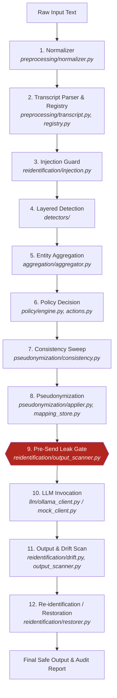

# Privacy Gateway — Project Architecture & Codebase Index

> **Notice for Developers and AI Agents**:
> This document is the single source of truth for the codebase layout, pipeline architecture, entity taxonomy, and operational invariants.
> **DO NOT** scan the entire codebase on every task. Consult this index first.
> **MANDATORY**: Whenever modifications are made to the codebase (such as adding/modifying detectors, policies, pipeline stages, or configurations), you **MUST** update this index. See [AGENTS.md](AGENTS.md) for agent guidelines.

---

## 1. Quick Overview & Philosophy

The **LLM Privacy Gateway** intercepts text on its way to a Large Language Model (LLM), detects sensitive entities across multiple independent layers, reconciles overlapping detections, filters them through an explicit policy engine, and pseudonymizes sensitive spans using reversible placeholders (e.g. `<PERSON_001>`, `<DATE_001>`).

Only sanitized text reaches the downstream LLM. The mapping is held securely in the local process memory and is restored upon receiving the LLM's response.

### The Five Invariants
1. **Source of Truth for Text**: Entity text is always sliced directly from the original/normalized source (`text[start:end]`). Reported strings from models are never trusted as entity text.
2. **Word-Bounded Alignment**: Entity spans are aligned to word boundaries. Sub-word fragments from models are widened or discarded.
3. **Offset-Based Replacement**: Replacement is performed strictly by character offsets from right to left (`end` to `start`). `str.replace()` is strictly forbidden for pseudonymization.
4. **Fatal Aggregation Invariants**: Output entities from aggregation must be pairwise disjoint, strictly sorted, and word-aligned.
5. **Anchored Single-Pass Restoration**: Restoration uses anchored regex replacement to eliminate prefix collisions.

### Performance & Framework Boundaries
* **Core Import Boundary**: The core pipeline (`gateway`, `preprocessing`, `aggregation`, `policy`, `pseudonymization`, `reidentification`) **must never import** heavy ML libraries (`torch`, `spacy`, `transformers`, `presidio_analyzer`).
* **Unit Test Speed**: Model-free unit tests run in `< 10s` because heavy frameworks are lazy-loaded inside `.warmup()` methods.

---

## 2. End-to-End Pipeline Workflow



### Stage-by-Stage Reference

| Stage | Module | Primary Class / Function | Description |
|---|---|---|---|
| **1. Normalize** | [`preprocessing/normalizer.py`](src/privacy_gateway/preprocessing/normalizer.py) | [`Normalizer`](src/privacy_gateway/preprocessing/normalizer.py#L38) | Normalizes line endings (CRLF -> LF), zero-width characters, HTML entities, and Unicode normalization (NFC) while maintaining exact offset mapping via [`OffsetMap`](src/privacy_gateway/preprocessing/offsets.py#L22). |
| **2. Transcript Parsing** | [`preprocessing/transcript.py`](src/privacy_gateway/preprocessing/transcript.py) | [`TranscriptParser`](src/privacy_gateway/preprocessing/transcript.py#L184) | Detects transcript structure (Teams, Markdown, bracketed logs, inline dialogue). Safely filters legal/deposition caption field labels (`Case No.`, `Job No.`, `Court Reporter`, `The Arbitrator`). |
| **3. Participant Registry** | [`preprocessing/registry.py`](src/privacy_gateway/preprocessing/registry.py) | [`ParticipantRegistry`](src/privacy_gateway/preprocessing/registry.py#L79) | Tracks document speakers, full names, first-name aliases, and handles ambiguous mentions across the document. Strips punctuation before stopword filtering. |
| **4. Injection Guard** | [`reidentification/injection.py`](src/privacy_gateway/reidentification/injection.py) | [`PlaceholderInjectionGuard`](src/privacy_gateway/reidentification/injection.py#L25) | Scans input for literal placeholder tokens (e.g. `<PERSON_001>`) and emits them as top-priority `LITERAL` entities, so an injected token is pseudonymized and can never restore to another person's value. |
| **5. Layered Detection** | [`detectors/`](src/privacy_gateway/detectors/) | [`RegexDetector`](src/privacy_gateway/detectors/regex_detector.py#L19), [`PresidioDetector`](src/privacy_gateway/detectors/presidio_detector.py#L44), [`DomainDetector`](src/privacy_gateway/detectors/domain_detector.py#L94), [`NERDetector`](src/privacy_gateway/detectors/ner_detector.py#L73) | Runs enabled detection layers. Outputs raw `DetectedEntity` instances. |
| **6. Aggregation** | [`aggregation/aggregator.py`](src/privacy_gateway/aggregation/aggregator.py) | [`EntityAggregator`](src/privacy_gateway/aggregation/aggregator.py#L113) | Validates spans, trims markdown/punctuation, strips trailing duration/timestamp suffixes from `PERSON_LIKE` entities, rejects invalid `DATE` candidates (bare numbers, clock times, durations), enforces $\ge 3$ char minimum floor on all `PERSON_LIKE` entities, filters common words across statistical and token registry mentions, and resolves overlaps. |
| **7. Policy Engine** | [`policy/engine.py`](src/privacy_gateway/policy/engine.py) | [`PolicyEngine`](src/privacy_gateway/policy/engine.py#L114) | Evaluates denylist, allowlist, entity confidence thresholds, and decides actions (`PSEUDONYMIZE`, `ALLOW`, `REDACT`, `MASK`). |
| **8. Consistency Sweep** | [`pseudonymization/consistency.py`](src/privacy_gateway/pseudonymization/consistency.py) | [`expand_occurrences`](src/privacy_gateway/pseudonymization/consistency.py#L55) | Recovers occurrences of protected values across the document that a statistical detector may have missed elsewhere in the text. |
| **9. Pseudonymization** | [`pseudonymization/applier.py`](src/privacy_gateway/pseudonymization/applier.py) | [`Pseudonymizer`](src/privacy_gateway/pseudonymization/applier.py#L42) | Allocates unique placeholders in [`MappingStore`](src/privacy_gateway/pseudonymization/mapping_store.py#L110) and substitutes values by offset (right-to-left). |
| **10. Pre-Send Gate** | [`reidentification/output_scanner.py`](src/privacy_gateway/reidentification/output_scanner.py) | [`OutputScanner`](src/privacy_gateway/reidentification/output_scanner.py#L32) | Unconditional assertion verifying that no protected raw entity value appears in plain text in the sanitized payload before sending to LLM. |
| **11. LLM Call** | [`llm/`](src/privacy_gateway/llm/) | [`OllamaLLMClient`](src/privacy_gateway/llm/ollama_client.py#L22) / [`EchoLLMClient`](src/privacy_gateway/llm/mock_client.py#L18) | Sends sanitized prompt to the model. |
| **12. Restoration** | [`reidentification/restorer.py`](src/privacy_gateway/reidentification/restorer.py) | [`Reidentifier`](src/privacy_gateway/reidentification/restorer.py#L35) | Restores placeholders in model output to their canonical or original values. Verifies output for drift and leaks. |
| **13. Audit & Reporting** | [`report.py`](src/privacy_gateway/report.py) | [`build_report`](src/privacy_gateway/report.py#L34) | Generates structured JSON audit report recording counts, timings, degraded detectors, and non-sensitive metadata. |

---

## 3. Entity Taxonomy & Current Policy Matrix

Policy decisions are configured in [`policy/actions.py`](src/privacy_gateway/policy/actions.py) (`DEFAULT_RULES`) and can be overridden via `config/policy.toml`.

### Active Policy Status

| Entity Type | Detection Layer | Default Action | Placeholder Prefix | Status / Rationale |
|---|---|---|---|---|
| `PERSON` | Registry, Presidio, NER | `PSEUDONYMIZE` | `<PERSON_xxx>` | Protected. |
| `EMPLOYEE` | Registry, Domain, NER | `PSEUDONYMIZE` | `<PERSON_xxx>` | Shares person counter prefix. |
| `STAKEHOLDER` | Registry, Domain, NER | `PSEUDONYMIZE` | `<PERSON_xxx>` | Shares person counter prefix. |
| `EMAIL` | Regex (RFC 5322), Presidio | `PSEUDONYMIZE` | `<EMAIL_xxx>` | Protected (case-sensitive). |
| `PHONE` | Regex (`PHONE_PATTERN`), Presidio | `PSEUDONYMIZE` | `<PHONE_xxx>` | Protected. Ignores timestamps and IPs. |
| `CREDIT_CARD` | Regex (`CREDIT_CARD_PATTERN`), Presidio | `PSEUDONYMIZE` | `<CARD_xxx>` | Protected (grouped digit runs). |
| `SSN` | Regex (`SSN_PATTERN`), Presidio (`US_SSN`) | `PSEUDONYMIZE` | `<SSN_xxx>` | Protected US SSN format. |
| `DATE` | Regex (`iter_date_matches`), Presidio | `PSEUDONYMIZE` | `<DATE_xxx>` | **Detected & Masked**: Calendar dates, DOB, expiry dates. Bare clock times, durations, and bare numbers are excluded. |
| `INTERNAL_SYSTEM` | Domain Lexicon | `PSEUDONYMIZE` | `<SYSTEM_xxx>` | Protected platforms (e.g. *FleetCore*). |
| `INTERNAL_SERVICE`| Domain Lexicon | `PSEUDONYMIZE` | `<SERVICE_xxx>` | Protected internal services. |
| `CUSTOMER` | Domain Lexicon | `PSEUDONYMIZE` | `<CUSTOMER_xxx>` | Protected client names (e.g. *BrightPath*). |
| `PROJECT` | Domain Lexicon | `PSEUDONYMIZE` | `<PROJECT_xxx>` | Protected project names. |
| `CONTRACT` | Domain Lexicon | `PSEUDONYMIZE` | `<CONTRACT_xxx>` | Protected contract IDs. |
| `CONFIDENTIAL...` | Regex (Connection strings, labeled secrets) | `PSEUDONYMIZE` | `<CONFIDENTIAL_xxx>` | Passwords, API keys, credentials. |
| `ORGANIZATION` | *Excluded* | `ALLOW` | — | **Excluded from masking**; passes through in plain text. |
| `LOCATION` / `ADDRESS` | *Excluded* | `ALLOW` | — | **Excluded from masking**; passes through in plain text. |
| `PASSPORT` / `PASSPORT_NUMBER` | *Excluded* | `ALLOW` | — | **Excluded from masking**; passes through in plain text. |
| `ACCOUNT_IDENTIFIER` / `CUSTOMER_ID` | *Excluded* | `ALLOW` | — | **Excluded from masking**; passes through in plain text (IBAN, account #). |
| `IP_ADDRESS` | *Excluded* | `ALLOW` | — | **Excluded from masking**; passes through in plain text. |
| `URL` / `INTERNAL_URL` | *Excluded* | `ALLOW` | — | **Excluded from masking**; passes through in plain text. |
| `SESSION_TOKEN` | *Excluded* | `ALLOW` | — | **Excluded from masking**; passes through in plain text. |
| `GEO` | *Excluded* | `ALLOW` | — | **Excluded from masking**; passes through in plain text. |
| `DEVICE_ID` | *Excluded* | `ALLOW` | — | **Excluded from masking**; passes through in plain text. |

---

## 4. Detection Layers & Priorities

Detectors operate with explicit priorities (`0` lowest, `100` highest). Higher priority wins on span conflicts:

```
[100] Participant Registry (Structural/Exact)
 [95] Placeholder Injection Guard & Consistency Sweep
 [90] Layer 1: Regex Detector (Deterministic High-Confidence Patterns)
 [80] Layer 2: Domain Detector (Configurable Business Lexicon)
 [60] Layer 1: Presidio Analyzer (spaCy-backed NER & Rule Recognizers)
 [40] Layer 4: Transformer NER (BERT Token Classification)
 [30] Layer 3: Qwen Detector (Local Semantic LLM - disabled by default)
```

1. **Participant Registry** ([`detectors/registry_detector.py`](src/privacy_gateway/detectors/registry_detector.py)): Structural matches from the transcript header and speaker turns.
2. **Regex Detector** ([`detectors/regex_detector.py`](src/privacy_gateway/detectors/regex_detector.py)): Pure deterministic regex from [`detectors/patterns.py`](src/privacy_gateway/detectors/patterns.py).
3. **Domain Detector** ([`detectors/domain_detector.py`](src/privacy_gateway/detectors/domain_detector.py)): Matches business terms loaded from `config/domain_lexicon.toml`.
4. **Presidio Detector** ([`detectors/presidio_detector.py`](src/privacy_gateway/detectors/presidio_detector.py)): Microsoft Presidio `AnalyzerEngine` using spaCy `en_core_web_lg`. Filters bare clock times, audio durations (`minutes`, `seconds`), and bare 1-2 digit numbers from `DATE_TIME` recognitions via [`is_invalid_date`](src/privacy_gateway/entities/spans.py).
5. **NER Detector** ([`detectors/ner_detector.py`](src/privacy_gateway/detectors/ner_detector.py)): Hugging Face token classification pipeline (`dslim/bert-base-NER`) with chunking.
6. **Qwen Detector** ([`detectors/qwen_detector.py`](src/privacy_gateway/detectors/qwen_detector.py)): Semantic detection using a local Ollama model. Re-grounds returned strings back to word-bounded source offsets.

---

## 5. Complete Codebase Directory Map

```
LLM-Privacy-Gateway/
├── AGENTS.md                          # Mandatory agent instructions & operating rules
├── PROJECT_INDEX.md                   # This file (Codebase architecture & module index)
├── README.md                          # Public project overview & benchmarks
├── LIMITATIONS.md                     # Measured performance boundaries & known edge cases
├── pyproject.toml                     # Dependencies, scripts, pytest configs
├── .env.example                       # Environment variable templates
├── config/
│   ├── domain_lexicon.toml            # Business-confidential terms (systems, customers)
│   └── policy.toml                    # Policy rule overrides (optional)
├── resources/
│   ├── common_words.txt               # Filter preventing ordinary English words from masking
│   ├── public_entities.txt            # Public allowlist (e.g. Microsoft, Azure)
│   └── denylist.txt                   # Unconditional protect list
├── test_data/                         # Real-world and synthetic meeting transcripts
├── src/privacy_gateway/
│   ├── __init__.py
│   ├── cli.py                         # CLI entry points ('run', 'sanitize')
│   ├── config.py                      # Strongly-typed environment configuration (Settings)
│   ├── errors.py                      # Hierarchical gateway exceptions
│   ├── gateway.py                     # Primary pipeline orchestrator (PrivacyGateway)
│   ├── report.py                      # Audit report builder
│   ├── aggregation/
│   │   ├── aggregator.py              # EntityAggregator, span validation, overlap arbitration
│   │   └── common_words.py            # Word filter loading & verification
│   ├── detectors/
│   │   ├── base.py                    # Detector interface & priorities
│   │   ├── domain_detector.py         # TOML-backed domain lexicon detector
│   │   ├── ner_detector.py            # Chunked BERT NER token classifier
│   │   ├── patterns.py                # Regexes (Email, Phone, Date, SSN, Secrets)
│   │   ├── presidio_detector.py       # Presidio AnalyzerEngine wrapper
│   │   ├── qwen_detector.py           # Local semantic Ollama model detector
│   │   ├── regex_detector.py          # Layer 1 deterministic pattern matcher
│   │   └── registry_detector.py       # Participant registry matcher
│   ├── entities/
│   │   ├── entity.py                  # DetectedEntity dataclass and make_entity factory
│   │   ├── spans.py                   # Word-boundary alignment and span math
│   │   └── taxonomy.py                # EntityType enum and DETECTOR_TYPE_MAP
│   ├── evaluation/                    # Measurement harness, gold datasets, precision/recall
│   ├── llm/
│   │   ├── base.py                    # LLMClient interface
│   │   ├── mock_client.py             # EchoLLMClient for testing without models
│   │   ├── ollama_client.py           # Production Ollama LLM client
│   │   └── prompt.py                  # Prompt wrapper and template injector
│   ├── observability/
│   │   └── timing.py                  # Hierarchical stage timer & metrics counter
│   ├── policy/
│   │   ├── actions.py                 # Action enum (PSEUDONYMIZE, ALLOW...) & DEFAULT_RULES
│   │   ├── allowlist.py               # Allowlist / denylist trie-based matcher
│   │   └── engine.py                  # PolicyEngine implementation
│   ├── preprocessing/
│   │   ├── normalizer.py              # Unicode & whitespace normalization
│   │   ├── offsets.py                 # Bidirectional index mapping for normalized text
│   │   ├── registry.py                # Participant & alias tracker
│   │   └── transcript.py              # Multi-format transcript speaker parser
│   ├── pseudonymization/
│   │   ├── applier.py                 # Right-to-left offset-based text rewriter
│   │   ├── consistency.py             # Sweep recovering missed occurrences
│   │   ├── mapping_store.py           # MappingStore and bidirectional placeholder lookups
│   │   └── placeholders.py            # Placeholder formatting (<PERSON_001>)
│   └── reidentification/
│       ├── drift.py                   # Model drift & placeholder corruption detection
│       ├── injection.py               # Pre-detection literal placeholder scanner
│       ├── output_scanner.py          # Pre-send and post-send leak detector
│       └── restorer.py                # Reidentifier replacing placeholders with original values
└── tests/
    ├── conftest.py                    # Shared pytest fixtures & test setup
    ├── unit/                          # Fast model-free unit tests (ran in ~8s)
    │   ├── test_date_and_exclusions.py# Tests for date detection & excluded entities
    │   ├── test_aggregation.py        # Overlap rules, character caps, word alignment
    │   ├── test_consistency.py        # Occurrence sweep tests
    │   ├── test_import_hygiene.py     # Enforces core isolation from heavy frameworks
    │   ├── test_policy.py             # Policy decisions & rule overrides
    │   ├── test_pseudonymization.py   # MappingStore & applier tests
    │   └── test_reidentification.py   # Restoration, drift & leak scan tests
    ├── regression/
    │   └── test_prototype_defects.py  # Pins historical prototype defects & fixes (including legal captions)
    ├── security/
    │   └── test_security.py           # Adversarial injection, obfuscation, zero-width, and fail-closed tests
    ├── integration/
    │   └── test_pipeline.py           # Multi-stage integration tests (mock client, round-trips)
    └── evaluation/
        ├── test_benchmark_honesty.py  # Benchmark honesty and reporting integrity
        └── test_gold_and_metrics.py   # Precision/recall metrics over gold labels
```

---

## 6. Common Developer Commands

```bash
# Run all model-free unit tests (fast, ~8 seconds)
uv run pytest tests/unit/

# Run date and exclusion tests
uv run pytest tests/unit/test_date_and_exclusions.py

# Run security and adversarial test suite
uv run pytest tests/security/

# Run end-to-end integration tests
uv run pytest tests/integration/

# Run regression tests excluding model-heavy tests
uv run pytest tests/regression/test_prototype_defects.py -m "not requires_models"

# Check import hygiene (verifies no torch/spacy/transformers in core)
uv run pytest tests/unit/test_import_hygiene.py

# Run latency benchmark across test corpus
uv run python benchmarks/bench.py --mode overhead --runs 5 --detectors regex,registry,domain

# Run the CLI end-to-end on a transcript
uv run privacy-gateway run test_data/transcript_test_new_2.txt --detectors regex,registry,domain
```
