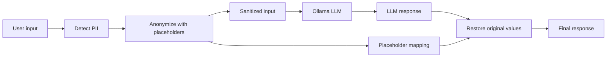

# LLM Privacy Gateway: PII De-identification and Re-identification

Protect personally identifiable information (PII) before sending text to an
LLM, then restore the original values in the response. The project detects
email addresses and named entities, replaces them with placeholders, and
restores them after the LLM call.

## Flow



## Prerequisites

- Python 3.12 or newer
- [uv](https://docs.astral.sh/uv/)
- [Ollama](https://ollama.com/) running locally with access to the model used by
  `main.py` (`gpt-oss:120b-cloud` by default)

## Installation

Clone the repository and install its dependencies with `uv`:

```bash
git clone https://github.com/Ahmed-Maher77/LLM-Privacy-Gateway___PII-De-identification-and-Re-identification
cd llm-privacy-gateway-pii-deidentification-and-reidentification
uv sync
```

The first run also downloads the `dslim/bert-base-NER` model through
Transformers. Make sure Ollama is running before starting the example.

## Usage

Run the example application:

```bash
uv run python main.py
```

The script prints the sanitized input, placeholder mapping, processing times,
and the final response with the original PII restored.

To use a different Ollama model, update the `model` value in `main.py` before
running the application.

## Project Layout

- `main.py` - example end-to-end LLM workflow
- `reduct_and_restore_PII.py` - PII detection, anonymization, and restoration
- `email_regex.py` - email address pattern
- `registery_detector.py` - custom organization recognizer
- `pyproject.toml` - project metadata and dependencies

## License

No license has been specified yet.
