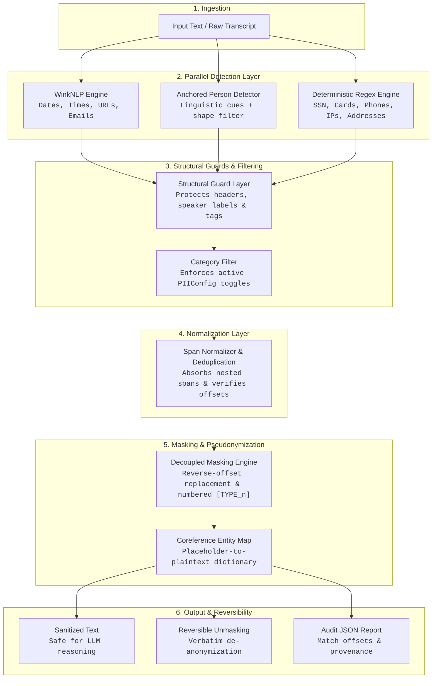

# WinkNLP PII Detection Proof of Concept (POC)

## 1. What the POC Is

This repository is a TypeScript Proof of Concept evaluating whether **WinkNLP** can serve as a PII (Personally Identifiable Information) detection engine for privacy middleware.

The POC investigates:
1. Which entity types WinkNLP can and cannot detect natively.
2. Exact character offset reconstruction in JavaScript strings and Unicode/Arabic text.
3. Hybrid multi-engine architecture combining WinkNLP with deterministic regex/rules.
4. Deterministic conflict resolution, deduplication, and decoupled masking.
5. Quantitative precision, recall, F1-score, and throughput benchmarks.

This is an **evaluation POC**, not a production middleware or service.

---

## 2. Why WinkNLP Was Selected

WinkNLP was evaluated for several potential advantages:
- **Zero External Network Dependencies**: Runs completely locally inside the Node.js runtime with zero data transmission to external APIs.
- **Lightweight Footprint**: Pre-trained model (`wink-eng-lite-web-model`) is ~1MB gzipped, allowing fast cold starts and minimal memory overhead.
- **Fast Linguistic Parsing**: Highly optimized finite-state automata (FSA) for tokenization, sentence boundary detection (SBD), POS tagging, and built-in NER.
- **Native Browser / Server Compatibility**: Same API works in Node.js and browser environments.

---

## 3. Installation

Ensure Node.js 22.12+ is installed (required by Vitest 5).

```bash
# Clone the repository and enter the directory
git clone <repository-url>
cd <repository-folder>

# Install dependencies
npm install
```

---

## 4. How to Run

### Run Automated Tests
```bash
npm test
```
Runs 57 unit and regression tests across 9 test suites (Vitest).

### Run Interactive / Sample Demo CLI
```bash
npm run demo
```
Runs `samples/large_sample.txt` through detection (dates enabled), numbered masking and round-trip unmask verification, writing `sanitized_output/`. You can also pass custom input directly (this also overwrites `sanitized_output/`):
```bash
npm run demo -- "Contact Ahmed at ahmed@example.com or call +20 100 123 4567."
```

### Run Precision / Recall / F1 Evaluation
```bash
npm run evaluate
```
Runs the labeled synthetic test dataset (20 scenarios) across 5 engine configurations and outputs full evaluation tables.

### Run Performance Benchmark
```bash
npm run benchmark
```
Benchmarks 100, 1,000, and 10,000 synthetic inputs measuring latency (min, max, avg, p95) and throughput (docs/sec).

### Build TypeScript to JavaScript
```bash
npm run build
```
Compiles TypeScript to `dist/` with ES2022 / NodeNext module declarations.

---

## 5. Example Input and Output

### Input:
```text
"My name is Ahmed Maher. My email is ahmed@example.com and my phone is +20 100 123 4567. Card on file: 4532-0150-0000-0007."
```

### Structured Output (`detectPII`):
```json
[
  {
    "type": "PERSON",
    "value": "Ahmed Maher",
    "start": 11,
    "end": 22,
    "method": "rule",
    "confidence": 0.95
  },
  {
    "type": "EMAIL",
    "value": "ahmed@example.com",
    "start": 36,
    "end": 53,
    "method": "regex",
    "confidence": 0.99
  },
  {
    "type": "PHONE",
    "value": "+20 100 123 4567",
    "start": 70,
    "end": 86,
    "method": "regex",
    "confidence": 0.95
  },
  {
    "type": "CREDIT_CARD",
    "value": "4532-0150-0000-0007",
    "start": 102,
    "end": 121,
    "method": "regex",
    "confidence": 0.98
  }
]
```

### Offset Verification Guarantee:
For every match $i$:
$$\text{text.slice}(\text{match.start}, \text{match.end}) \equiv \text{match.value}$$

### Masked Output (`maskPII`):
```text
"My name is [PERSON]. My email is [EMAIL] and my phone is [PHONE]. Card on file: [CREDIT_CARD]."
```

---

## 6. Architecture


```mermaid
flowchart TD
    subgraph S1["1. Ingestion"]
        A["Input Text / Raw Transcript"]
    end

    subgraph S2["2. Parallel Detection Layer"]
        B1["WinkNLP Engine<br/><code>Dates, Times, URLs, Emails</code>"]
        B2["Anchored Person Detector<br/><code>Linguistic cues + shape filter</code>"]
        B3["Deterministic Regex Engine<br/><code>SSN, Cards, Phones, IPs, Addresses</code>"]
    end

    subgraph S3["3. Structural Guards & Filtering"]
        C["Structural Guard Layer<br/><code>Protects headers, speaker labels & tags</code>"]
        D["Category Filter<br/><code>Enforces active PIIConfig toggles</code>"]
    end

    subgraph S4["4. Normalization Layer"]
        E["Span Normalizer & Deduplication<br/><code>Absorbs nested spans & verifies offsets</code>"]
    end

    subgraph S5["5. Masking & Pseudonymization"]
        F["Decoupled Masking Engine<br/><code>Reverse-offset replacement & numbered [TYPE_n]</code>"]
        G["Coreference Entity Map<br/><code>Placeholder-to-plaintext dictionary</code>"]
    end

    subgraph S6["6. Output & Reversibility"]
        H1["Sanitized Text<br/><code>Safe for LLM reasoning</code>"]
        H2["Reversible Unmasking<br/><code>Verbatim de-anonymization</code>"]
        H3["Audit JSON Report<br/><code>Match offsets & provenance</code>"]
    end

    A --> B1 & B2 & B3
    B1 & B2 & B3 --> C
    C --> D
    D --> E
    E --> F
    F --> G
    G --> H1
    G --> H2
    G --> H3
```

### Main Pipeline Layers:

1. **Ingestion Layer**: Receives raw strings, dialogue transcripts, or file inputs without mutating state.
2. **Parallel Detection Layer**: Runs statistical WinkNLP entity extraction, anchored conversational person detection, and deterministic regex pattern matchers in parallel.
3. **Structural Guards & Filtering Layer**: Suppresses heuristic matches overlapping bracketed markers (`[START OF TRANSCRIPT]`) and speaker labels (`Agent:`), then filters out disabled categories per `PIIConfig`.
4. **Normalization & Verification Layer**: Deduplicates matches, absorbs nested spans, resolves partial overlaps, and strictly enforces the offset invariant (`text.slice(start, end) === value`).
5. **Decoupled Masking & Pseudonymization Layer**: Replaces spans in reverse offset order to prevent index drift, with support for coreference-aware numbered placeholders (`[PERSON_1]`, `[EMAIL_1]`).
6. **Output & Reversibility Layer**: Emits sanitized text, provides single-pass lossless de-anonymization (`unmaskPII`), and writes structured audit reports (`output_in_file`).

### Module Structure:
- `src/pii/types.ts`: Normalized types (`PIIType`, `PIIMatch`, `PIIConfig`, `EntityMap`).
- `src/pii/config.ts`: Configuration resolution and category toggle mapping.
- `src/pii/wink-detector.ts`: Isolated WinkNLP wrapper with token span to character offset conversion.
- `src/pii/person-detector.ts`: Anchored conversational name detector and token shape filter.
- `src/pii/regex-detector.ts`: High-precision deterministic rules for emails, phones, URLs, IPs, cards, SSNs, and addresses.
- `src/pii/exact-match.ts`: Whole-word exact matching for caller-supplied `knownNames`, `knownLocations`, `knownOrganizations` (plus shared `escapeRegex`).
- `src/pii/structure.ts`: Structural guards protecting transcript tags and speaker prefixes.
- `src/pii/normalizer.ts`: Deterministic deduplication, enclosing span resolution, and strict substring verification.
- `src/pii/detector.ts`: Central hybrid orchestrator.
- `src/pii/masker.ts`: Decoupled string mask and reversible unmask utility.
- `src/sanitizer-output.ts`: Output file writer and JSON audit report generator.

---

## 7. Supported PII Categories

| Category | Default State | Detection Method | Description |
| :--- | :--- | :--- | :--- |
| `EMAIL` | Enabled | WinkNLP + Regex | Standard RFC 5322 & international domains |
| `PHONE` | Enabled | Regex | International (+20, +1), US (555), and domestic formats |
| `URL` | Enabled | WinkNLP + Regex | HTTP/HTTPS and www URLs with punctuation trimming |
| `IP_ADDRESS` | Enabled | Regex | IPv4 addresses with strict 0-255 octet validation |
| `CREDIT_CARD` | Enabled | Regex + Luhn | 13-19 digit cards (shape-first, scored Luhn / brand prefix) |
| `SSN` | Enabled | Regex | US Social Security Numbers (shape-first, scored SSA issuance) |
| `ADDRESS` | Enabled | Regex | Street address, city, US state, and ZIP postal code |
| `PERSON` | Enabled | Rules (Anchored) | Conversational anchors ('my name is', greetings) + shape validation |
| `LOCATION` | Disabled | Caller Injection | Exact match via `knownLocations` (no native WinkNLP NER) |
| `ORGANIZATION` | Disabled | Caller Injection | Exact match via `knownOrganizations` (no native WinkNLP NER) |
| `DATE` | Disabled | WinkNLP | General dates (April 1, 1976; 2023-10-27; requires digits) |
| `TIME` | Disabled | WinkNLP | Time references |
| `MENTION` | Disabled | WinkNLP | Social handles (@username) |

---

## 8. WinkNLP-Supported vs. Regex Detections

| PII Type | WinkNLP Native | Regex / Rules | Empirical Finding |
| :--- | :--- | :--- | :--- |
| **Person** | ❌ (No NER) | ✅ Anchored Rules | WinkNLP lite model lacks PERSON NER. Anchored linguistic patterns (`person-detector.ts`) give 0 false positives; adding `knownNames` lifts recall to 85.7% at 1 false positive. |
| **Email** | ✅ Yes | ✅ Yes | Both detect emails reliably. Regex adds boundary safety. |
| **Phone** | ❌ No | ✅ Yes | WinkNLP does not recognize phone numbers; tokenizes into digits and punctuation. Regex is mandatory. |
| **URL** | ✅ Yes | ✅ Yes | WinkNLP detects URLs but occasionally captures trailing punctuation. Regex provides clean punctuation trimming. |
| **IP Address** | ❌ No | ✅ Yes | WinkNLP splits IPs into multiple CARDINAL tokens. Regex with 0-255 validation is deterministic. |
| **Credit Card** | ❌ No | ✅ Yes | WinkNLP treats cards as cardinals or hyphenated tokens. Regex with brand prefix + Luhn provides shape-first masking. |
| **SSN** | ❌ No | ✅ Yes | WinkNLP splits into numbers and hyphens. Regex provides shape-first masking with SSA validation scoring. |
| **Address** | ❌ No | ✅ Yes | `ADDRESS_PATTERN` deterministically captures street suffixes, city, state, and ZIP. |
| **Date** | ✅ Yes | — | WinkNLP has built-in DATE recognition; filtered to require digits to exclude relative terms (`today`). |
| **Location** | ❌ (No NER) | ✅ Caller Injection | Not present in WinkNLP lite model. Supported via caller `knownLocations`. |
| **Organization** | ❌ (No NER) | ✅ Caller Injection | Not present in WinkNLP lite model. Supported via caller `knownOrganizations`. |

---

## 9. Evaluation Results (Precision, Recall, F1)

Evaluated on the synthetic benchmark dataset (`src/evaluate.ts`) containing 20 representative test cases with 29 labeled ground-truth entities:

### Overall Engine Comparison:
| Engine | Precision | Recall | F1 Score | TP | FP | FN | Notes |
| :--- | :--- | :--- | :--- | :--- | :--- | :--- | :--- |
| **1. WinkNLP (Built-in Only)** | **90.0%** | **31.0%** | **46.2%** | 9 | 1 | 20 | Detects emails and URLs only (1 false-positive DATE) |
| **2. Deterministic Regex Alone** | **100.0%** | **65.5%** | **79.2%** | 19 | 0 | 10 | Structured PII (email, phone, URL, IP, card, SSN) |
| **3. Combined Hybrid (Anchored Default)** | **100.0%** | **75.9%** | **86.3%** | 22 | 0 | 7 | **0 False Positives** globally across benchmark |
| **4. Combined Hybrid (PROPN Heuristic)** | **67.6%** | **86.2%** | **75.8%** | 25 | 12 | 4 | Higher open recall but 12 false positives |
| **5. Combined Hybrid (Anchored + Known Names)** | **96.2%** | **86.2%** | **90.9%** | 25 | 1 | 4 | Recovers unanchored names with high precision |

### Category Breakdown for Default Anchored Hybrid Engine:
| Category | TP | FP | FN | Precision | Recall | F1 Score | Notes |
| :--- | :--- | :--- | :--- | :--- | :--- | :--- | :--- |
| `EMAIL` | 7 | 0 | 0 | 100.0% | 100.0% | **100.0%** | Flawless detection across standard and sub-domains |
| `PHONE` | 5 | 0 | 0 | 100.0% | 100.0% | **100.0%** | International (+20), US (+1), and local mobile formats |
| `URL` | 3 | 0 | 0 | 100.0% | 100.0% | **100.0%** | Protocol and www prefixes with punctuation trimming |
| `IP_ADDRESS` | 2 | 0 | 0 | 100.0% | 100.0% | **100.0%** | Strict 0-255 octet validation |
| `CREDIT_CARD` | 1 | 0 | 0 | 100.0% | 100.0% | **100.0%** | Validated format and checksum |
| `SSN` | 1 | 0 | 0 | 100.0% | 100.0% | **100.0%** | Standard 9-digit format |
| `PERSON` | 3 | 0 | 4 | 100.0% | 42.9% | **60.0%** | **100% precision (0 false positives)** on anchored mentions |
| `LOCATION` | 0 | 0 | 2 | 0.0% | 0.0% | **0.0%** | No native NER in WinkNLP (recovers via `knownLocations`) |
| `ORGANIZATION` | 0 | 0 | 1 | 0.0% | 0.0% | **0.0%** | No native NER in WinkNLP (recovers via `knownOrganizations`) |

*(For legacy comparison, the experimental `propn` strategy yields TP: 6, FP: 12, FN: 1 with 33.3% precision and 85.7% recall, trading precision for recall).*

---

## 10. Performance Results

Benchmarked on Node.js v24 across 100, 1,000, and 10,000 synthetic documents (`src/benchmark.ts`):

| Scale | Engine | Total (ms) | Avg Latency | Min Latency | Max Latency | p95 Latency | Throughput |
| :--- | :--- | :--- | :--- | :--- | :--- | :--- | :--- |
| **100 docs** | Regex Rules | 0.6 ms | 0.006 ms | 0.002 ms | 0.033 ms | 0.015 ms | **165,098 doc/s** |
| | WinkNLP Built-in | 17.9 ms | 0.179 ms | 0.088 ms | 0.424 ms | 0.302 ms | **5,584 doc/s** |
| | Combined Hybrid | 27.3 ms | 0.273 ms | 0.116 ms | 6.084 ms | 0.508 ms | **3,659 doc/s** |
| **1,000 docs** | Regex Rules | 3.5 ms | 0.003 ms | 0.001 ms | 0.125 ms | 0.006 ms | **287,670 doc/s** |
| | WinkNLP Built-in | 133.7 ms | 0.134 ms | 0.061 ms | 3.837 ms | 0.231 ms | **7,480 doc/s** |
| | Combined Hybrid | 124.4 ms | 0.124 ms | 0.062 ms | 3.117 ms | 0.201 ms | **8,041 doc/s** |
| **10,000 docs** | Regex Rules | 30.7 ms | 0.003 ms | 0.001 ms | 1.251 ms | 0.005 ms | **325,419 doc/s** |
| | WinkNLP Built-in | 949.2 ms | 0.095 ms | 0.039 ms | 5.749 ms | 0.173 ms | **10,535 doc/s** |
| | Combined Hybrid | 1057.0 ms | 0.106 ms | 0.055 ms | 2.095 ms | 0.196 ms | **9,461 doc/s** |

### Latency Takeaway:
The combined hybrid engine processes 10,000 documents in **~1.05 seconds** with an average latency of **0.106 ms** and a 95th percentile latency under **0.20 ms**. This is more than fast enough for low-overhead privacy middleware.

---

## 11. Answers to Important POC Questions (Q1 - Q12)

### Q1: Can WinkNLP detect names reliably?
**No.** WinkNLP's standard language model (`wink-eng-lite-web-model`) has **no built-in PERSON NER entity**. Using POS tagging (consecutive `PROPN` tokens) as a name heuristic achieves 85.7% recall but suffers from poor precision (33.3%), misclassifying non-name proper nouns (e.g. capitalized sentence starters, technology terms, days of the week).

### Q2: Can WinkNLP detect locations and organizations?
**No.** The lite model does not include `LOCATION` or `ORGANIZATION` entity extractors.

### Q3: Can WinkNLP detect email addresses, URLs, and phone numbers?
- **Email**: Yes, 100% precision and recall.
- **URL**: Yes, but it occasionally includes trailing punctuation (e.g., brackets or closing quotes).
- **Phone**: **No.** WinkNLP splits phone numbers into discrete `CARDINAL` tokens and punctuation (e.g. `+20`, `100`, `123`, `4567`). Deterministic regex is required for phone numbers.

### Q4: Does WinkNLP provide reliable character offsets?
**Yes.** While WinkNLP returns token-level span indices `[startToken, endToken]`, exact character offsets are cleanly reconstructed by tracking cumulative token lengths and `precedingSpaces`. 100% of tested matches satisfy `text.slice(start, end) === value`.

### Q5: How does it behave with Arabic/mixed-language text?
WinkNLP tokenizes Arabic words as foreign tokens (`X`), which does not break the tokenizer. Emails or URLs embedded inside Arabic passages (e.g. `اسمي أحمد والبريد الإلكتروني ahmed@example.com`) are extracted accurately with correct character offsets. However, Arabic names (e.g. `أحمد`) are tagged as `X` and cannot be identified by POS proper noun heuristics.

### Q6: How does it behave with multiple entities in the same sentence?
Cleanly. WinkNLP tokenizes the full document in a single pass and returns discrete, non-overlapping entity spans across all sentences.

### Q7: How does it behave when entities are surrounded by punctuation?
- Emails surrounded by angle brackets (e.g. `<user@example.com>`) are extracted without the brackets.
- URLs surrounded by parentheses or square brackets sometimes capture the trailing bracket in WinkNLP. Our regex detector and normalizer trim trailing punctuation.

### Q8: What PII categories require deterministic regex/rules?
1. **Phone numbers**: Completely absent from WinkNLP NER.
2. **IP addresses**: WinkNLP tokenizes IPs into numbers and periods.
3. **Credit card numbers**: Requires Luhn checksum validation.
4. **SSN / National IDs**: Fixed pattern requirements.
5. **URL trailing punctuation cleanup**: Deterministic boundary enforcement.

### Q9: What false positives does WinkNLP produce?
When attempting to detect person names via POS `PROPN`, capitalized sentence starters (e.g. `Contact`, `Please`), technology terms (`API`, `Host`), days of week (`Monday`), and acronyms are misclassified as `PERSON`.

### Q10: What false negatives does it produce?
- 100% of phone numbers, IP addresses, credit cards, SSNs, locations, and organizations are missed by WinkNLP native NER.
- Non-English names (e.g., Arabic names) are missed because they are tagged as foreign words (`X`).

### Q11: What is the performance for typical request sizes?
- Average latency is **~0.10 ms** per document.
- Throughput exceeds **9,000 requests/second** on a single Node.js thread.

### Q12: Can it run completely locally without sending user data to an external API?
**Yes.** All processing is 100% local, executed in memory with zero HTTP calls or disk writes.

---

## 12. Limitations

1. **Lack of General NER in Lite Model**: `wink-eng-lite-web-model` only targets web-centric entities (`CARDINAL`, `DATE`, `DURATION`, `EMAIL`, `EMOJI`, `EMOTICON`, `HASHTAG`, `MENTION`, `MONEY`, `ORDINAL`, `PERCENT`, `TIME`, `URL`). It lacks true transformer/statistical NER for `PERSON`, `LOCATION`, `ORGANIZATION`.
2. **English-Centric POS Model**: POS tagging is trained on English (Penn Treebank / WSJ). Multilingual name detection fails.
3. **No Contextual Disambiguation**: WinkNLP cannot determine whether a 9-digit number is an SSN, a phone number, or a tracking ID without deterministic regex rules.

---

## 13. Recommendations for Next Steps

1. **Adopt a Hybrid Architecture**:
   - Use deterministic regex for structured identifiers (`EMAIL`, `PHONE`, `URL`, `IP_ADDRESS`, `CREDIT_CARD`, `SSN`).
   - Use WinkNLP for fast tokenization, sentence boundaries, and temporal entities (`DATE`, `TIME`).
2. **For Person, Location, and Organization Detection**:
   - If local execution is mandatory, evaluate a dedicated lightweight ONNX transformer model (such as Xenova/transformers.js running a quantized `bert-base-NER` or `gliner`) which natively detects `PERSON`, `LOC`, and `ORG` with high F1.
   - For simple known domains, allow custom dictionary matching alongside WinkNLP custom entities (`learnCustomEntities`).
3. **Preserve Decoupled Masking**: Keep detection findings as structured JSON spans, separate from policy-driven text transformation.
