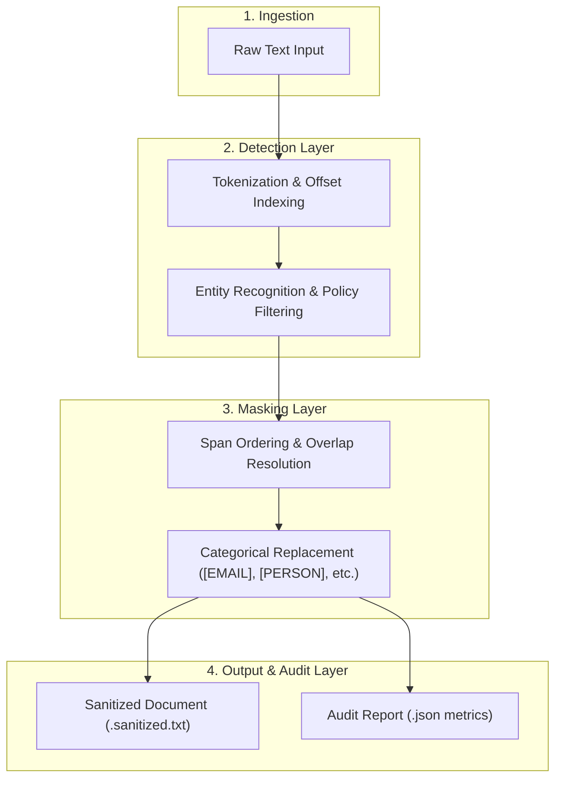

# WinkNLP PII Redaction Pipeline

A lightweight Node.js/TypeScript pipeline for identifying and redacting Personally Identifiable Information (PII) using [`wink-nlp`](https://winkjs.org/wink-nlp/) and the [`wink-eng-lite-web-model`](https://www.npmjs.com/package/wink-eng-lite-web-model).

## Pipeline Architecture & Data Flow

The following diagram illustrates the primary layers and stages data passes through during detection, redaction, and reporting:


```mermaid
flowchart TD
    subgraph S1["1. Ingestion"]
        A["Raw Text Input"]
    end

    subgraph S2["2. Detection Layer"]
        B["Tokenization & Offset Indexing"]
        C["Entity Recognition & Policy Filtering"]
        B --> C
    end

    subgraph S3["3. Masking Layer"]
        D["Span Ordering & Overlap Resolution"]
        E["Categorical Replacement ([EMAIL], [PERSON], etc.)"]
        D --> E
    end

    subgraph S4["4. Output & Audit Layer"]
        F["Sanitized Document (.sanitized.txt)"]
        G["Audit Report (.json metrics)"]
    end

    A --> B
    C --> D
    E --> F
    E --> G
```

### Main Pipeline Layers

1. **Ingestion Layer**: Accepts unstructured raw text or transcript data.
2. **Detection Layer**:
   - **Tokenization & Offset Indexing**: Parses text into tokens and builds character offset maps in a single O(N) pass.
   - **Entity Recognition & Policy Filtering**: Extracts named entities (email, phone, dates, persons, orgs, etc.) and evaluates against active configuration flags.
3. **Masking Layer**:
   - **Span Ordering & Overlap Resolution**: Sorts entity matches ascending by offset and prunes overlapping spans to avoid corrupting text replacements.
   - **Categorical Replacement**: Sequentially substitutes sensitive spans with standard bracketed placeholders (e.g., `[EMAIL]`, `[DATE]`, `[PERSON]`).
4. **Output & Audit Layer**: Generates sanitized text output alongside execution telemetry and structured detection metadata.

## Features

- **Entity Recognition**: Detects PII entities including:
  - Emails
  - URLs & Mentions
  - Dates & Times
  - Phone Numbers
  - Persons, Locations & Organizations
- **Automated Masking**: Replaces detected sensitive entities with clear categorical placeholders (e.g., `[EMAIL]`, `[DATE]`).
- **Reporting**: Generates execution metrics and detection logs in JSON and sanitized text formats.

## Getting Started

### Prerequisites

- Node.js (v18+ recommended)
- npm or yarn

### Installation

```bash
npm install
```

### Configuration

Copy the example environment configuration:

```bash
cp .env.example .env
```

### Running the Pipeline

Run the pipeline against the default synthetic test fixture:

```bash
npm run dev
```

Sanitized output and analysis reports will be generated in the `reports/` directory.

## Testing & Fixtures

The `test_data/` directory contains synthetic test cases designed to evaluate entity recognition and redaction accuracy across various scenarios. All test cases use synthetic/mock data.

## License

ISC
