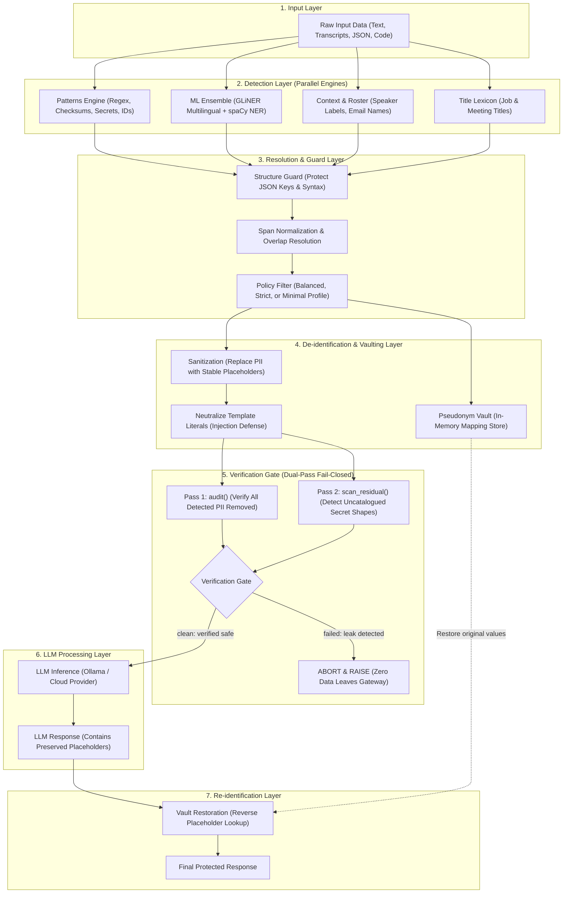

# LLM Privacy Gateway: GLiNER + spaCy PII De-identification and Re-identification

A Python gateway that removes personally identifiable information (PII) from text
before it is sent to a large language model (LLM), then puts the original values
back into the response. Four detection layers (regex patterns, a GLiNER + spaCy
model ensemble, a participant roster and a title lexicon) feed one span resolver;
every match is replaced by a stable placeholder such as `{{PERSON_1}}`, and two
independent verification passes must agree before anything leaves the machine.
If verification fails, the text is not transmitted.

Part of the [PII de-identification implementations](https://github.com/Ahmed-Maher77/LLM-Privacy-Gateway___PII-De-identification-and-Re-identification#readme) collection.

## At a glance

| | |
| --- | --- |
| Language/runtime | Python 3.12+, managed with [uv](https://docs.astral.sh/uv/) |
| Approach | Regex rules with graded checksums, GLiNER + spaCy NER ensemble, speaker roster and name propagation, title lexicon; structure-aware span resolution; two-pass fail-closed verification |
| Entities | People; contact details (email, phone, URL, address); financial (card, CVV, expiry, routing, account, IBAN, SWIFT/BIC, EU VAT); government and document IDs (SSN, passport, DOB, labelled IDs); network (IP, MAC); secrets (connection strings, credentials, bearer tokens, JWTs); nationality/religion (NORP); organizations and locations under `strict` |
| Reversible | Yes: an in-memory placeholder vault per call; `restore_for()` puts originals back into the LLM response |
| Network at runtime | Detection and restoration are local. First run downloads the GLiNER model from Hugging Face. The LLM step calls Ollama; the default model is an Ollama Cloud model |
| Models | `urchade/gliner_multi_pii-v1` (about 1.16 GB, Apache-2.0) and spaCy `en_core_web_lg` 3.8.0 (about 425 MB, MIT) |
| Best for | Sanitising meeting transcripts, support tickets, logs and mixed prose/JSON before an LLM call, on CPU, where a few seconds per document is acceptable |
| Status | Advanced prototype with production-hardening features; not validated on a real-world labelled corpus |

## Contents

- [Quick start](#quick-start)
- [Usage](#usage)
- [How it works](#how-it-works)
- [Verification](#verification)
- [Detection layers](#detection-layers)
- [Structure preservation](#structure-preservation)
- [Redaction policy](#redaction-policy)
- [Security properties](#security-properties)
- [Custom patterns](#custom-patterns)
- [Evaluation](#evaluation)
- [Performance and concurrency](#performance-and-concurrency)
- [Data at rest](#data-at-rest)
- [Testing](#testing)
- [Limitations](#limitations)
- [Project layout](#project-layout)
- [License](#license)

## Quick start

### Prerequisites

- Python 3.12 or newer (uv installs it automatically if missing; `.python-version` pins 3.12)
- [uv](https://docs.astral.sh/uv/)
- About 3 GB of free disk space: the virtual environment is about 1.4 GB on
  Windows with the CPU build of PyTorch (Linux installs from PyPI pull a larger
  CUDA build), plus about 1.16 GB for the GLiNER weights in the Hugging Face cache
- [Ollama](https://ollama.com/), only for the LLM step. The default model
  `gpt-oss:120b-cloud` is an Ollama Cloud model; pass `--model` to
  `generate_report.py` to use another. Anonymisation and verification alone
  (`--skip-llm`) do not need Ollama

### Installation

```bash
uv sync                                          # runtime + dev dependencies from uv.lock
uv run python -m spacy download en_core_web_lg   # spaCy model (~425 MB)
cp .env.example .env                             # PowerShell: Copy-Item .env.example .env
```

- The spaCy model is not part of `uv.lock`. A plain `uv sync` removes packages
  that are not in the lock file, so run the download again after any later `uv sync`.
- The virtual environment has no pip; `spacy download` falls back to `uv pip install`.
- The first analysis downloads `urchade/gliner_multi_pii-v1` (about 1.16 GB) and the
  `microsoft/mdeberta-v3-base` tokenizer. Later runs load them from the cache. Set
  `HF_HUB_OFFLINE=1` to forbid network access once the cache is populated.
- The spaCy model is optional for `PIIMiddleware()`: without it the ensemble falls
  back to GLiNER alone, warns, and records the reduced coverage in the report.
  `PIIMiddleware.for_production()` and therefore `main.py` require it.

### First run

Anonymise and verify a sample transcript without calling an LLM:

```bash
uv run python generate_report.py test_data/sme_meeting_transcript.txt --skip-llm
```

This writes `reports/sme_meeting_transcript_run.json` (no PII by default) and, if
verification is `clean`, `reports/sanitized/sme_meeting_transcript.txt`. The first
run is slow while the models download and load.

Full round trip (anonymise, call the LLM through Ollama, restore):

```bash
uv run python main.py
```

## Usage

### `generate_report.py`

```bash
uv run python generate_report.py INPUT_FILE [options]
```

| Option | Default | Effect |
| --- | --- | --- |
| `--report PATH` | `reports/<input stem>_run.json` | Where to write the JSON report |
| `--model NAME` | `gpt-oss:120b-cloud` | Ollama model for the LLM step |
| `--profile NAME` | `balanced` | `balanced`, `strict` or `minimal` (see [Redaction policy](#redaction-policy)) |
| `--entity KEY=true\|false` | none | Override one entity type, independent of the profile. Repeatable |
| `--fixed-name NAME` | none | Mask this name wherever it appears, independent of detection. Repeatable |
| `--sanitized-out PATH` | `reports/sanitized/<input stem>.txt` | Sanitised text, written only when status is `clean` |
| `--skip-llm` | off | Anonymise and verify only; do not call the LLM |
| `--strict` | off | Treat medium-confidence residual findings (`review`) as a failure |
| `--explain` | off | Print every residual finding, including suppressed ones, so "why wasn't X flagged?" is answerable |
| `--include-secrets` | off | Write real PII (mapping, roster, restored response) into the report. Warns loudly; the file must not be committed |

The LLM is called only when verification is `clean`. Exit codes: `0` clean (or
`review` without `--strict`), `1` other package error, `2` usage error (including an
unknown `--entity` key), `3` leak detected, `4` review required under `--strict`.
The help text also lists `5` (detector missing); this CLI does not require
detectors, so a missing spaCy model produces a warning rather than exit code 5.

Examples:

```bash
uv run python generate_report.py test_data/sme_meeting_transcript.txt --skip-llm
uv run python generate_report.py test_data/sme_meeting_transcript.txt --strict --explain
uv run python generate_report.py test_data/sme_meeting_transcript.txt --profile strict --entity duration=true
uv run python generate_report.py test_data/sme_meeting_transcript.txt --include-secrets
```

### `main.py`

`uv run python main.py` takes no arguments. It reads
`test_data/sme_meeting_transcript.txt` (synthetic), builds
`PIIMiddleware.for_production()`, sends `result.safe_sanitized` to
`gpt-oss:120b-cloud` through Ollama, and prints the restored response with timings.
Edit `INPUT_FILE` and `MODEL` at the top of the file to change them.

### Evaluation and maintenance tools

| Command | Purpose |
| --- | --- |
| `uv run python tools/evaluate.py [--only NAME] [--select GLOB] [--dir DIR] [--profile P] [--entity K=V] [--fixed-name N] [--repeat N] [--show-fp N] [--triage] [--report] [--sanitized-dir DIR] [--include-secrets] [--baseline]` | Score the labelled corpus (see [Evaluation](#evaluation)) |
| `uv run python tools/benchmark.py [--cold-start-samples N] [--skip-cold-start] [--warmup N] [--repeats N] [--workers 1,2,4] [--rounds N] [--limit N] [--report]` | Cold start, latency, throughput and memory |
| `uv run python tools/make_holdout.py [--check] [--seed N] [--out DIR]` | Regenerate the held-out corpus, or with `--check` verify its pools are disjoint |
| `uv run python tools/derive_gold_spans.py [--check] [--write] [--only NAME] [--dir DIR]` | Validate or derive offset-anchored gold spans |
| `uv run python tools/import_corpus.py --source DIR --out DIR [--overwrite] [--check]` | Stage real documents for labelling (outside the repository) |

### Library

```python
from pii import PIIMiddleware, PIIError

# Fail-closed instance: on_leak="raise", strict=True, both models required, eager warm-up.
middleware = PIIMiddleware.for_production()

try:
    result = middleware.analyze(text)              # AnonymizationResult
except PIIError as exc:                            # LeakDetected, ReviewRequired, ...
    raise SystemExit(exc.exit_code)

print(result.status)       # "clean" | "review" | "failed"
print(result.mapping)      # {"{{PERSON_1}}": "Priya Raman", ...}
response = llm.invoke(result.safe_sanitized)       # raises LeakDetected if status is "failed"
final = middleware.restore_for(response.content, result)
```

A configurable instance:

```python
middleware = PIIMiddleware(
    profile="balanced",                     # "balanced" | "strict" | "minimal"
    entities={"url": False, "duration": True},
    fixed_names=["Priya Raman", "Devesh Raman"],
    on_leak="raise",                        # "raise" | "warn" | "ignore"
    strict=False,                           # True: "review" raises ReviewRequired
    require_detectors=False,                # True: a missing spaCy model raises DetectorUnavailable
    patterns_config=None,                   # path to a custom pattern TOML
)
sanitized, mapping = middleware.anonymize(text)    # shortcut returning (safe_sanitized, mapping)
restored = middleware.restore(llm_output, mapping) # prefer restore_for(), which cannot forget the escape table
```

Other constructor options include `use_spacy`, `use_roster`, `use_titles`,
`threshold` (GLiNER, default 0.45), `model_name`, `allowlist`,
`escape_placeholders` (`"neutralize"` default, `"reject"`, `"ignore"`) and
`person_evidence` (`"corroborated"` default, `"any"`).

### Configuration

Environment variables (load them from `.env`; `main.py` and `generate_report.py` read it):

| Variable | Default | Purpose |
| --- | --- | --- |
| `HF_TOKEN` | unset | Hugging Face token, avoids download rate limits |
| `PII_TORCH_THREADS` | half the logical CPUs, minimum 1 | PyTorch intra-op threads per worker; read by `PIIMiddleware.for_production()` only |
| `PII_PATTERNS_CONFIG` | unset | Path to a custom pattern TOML file |
| `HF_HUB_OFFLINE` | unset | Standard Hugging Face switch; `1` forbids model downloads |

Custom pattern files are resolved in this order: the `patterns_config` argument,
then `PII_PATTERNS_CONFIG`, then `pii_patterns.toml` or `.pii-patterns.toml` in the
current directory or any parent. See [Custom patterns](#custom-patterns).

## How it works

The gateway processes data through seven layers, from multi-engine detection and
structural guards to fail-closed verification and response restoration:


```mermaid
flowchart TD
    subgraph S1["1. Input Layer"]
        A["Raw Input Data (Text, Transcripts, JSON, Code)"]
    end

    subgraph S2["2. Detection Layer (Parallel Engines)"]
        B1["Patterns Engine (Regex, Checksums, Secrets, IDs)"]
        B2["ML Ensemble (GLiNER Multilingual + spaCy NER)"]
        B3["Context & Roster (Speaker Labels, Email Names)"]
        B4["Title Lexicon (Job & Meeting Titles)"]
    end

    subgraph S3["3. Resolution & Guard Layer"]
        C1["Structure Guard (Protect JSON Keys & Syntax)"]
        C2["Span Normalization & Overlap Resolution"]
        C3["Policy Filter (Balanced, Strict, or Minimal Profile)"]
    end

    subgraph S4["4. De-identification & Vaulting Layer"]
        D1["Pseudonym Vault (In-Memory Mapping Store)"]
        D2["Sanitization (Replace PII with Stable Placeholders)"]
        D3["Neutralize Template Literals (Injection Defense)"]
    end

    subgraph S5["5. Verification Gate (Dual-Pass Fail-Closed)"]
        E1["Pass 1: audit() (Verify All Detected PII Removed)"]
        E2["Pass 2: scan_residual() (Detect Uncatalogued Secret Shapes)"]
        GATE{"Verification Gate"}
        FAIL["ABORT & RAISE (Zero Data Leaves Gateway)"]
    end

    subgraph S6["6. LLM Processing Layer"]
        F1["LLM Inference (Ollama / Cloud Provider)"]
        F2["LLM Response (Contains Preserved Placeholders)"]
    end

    subgraph S7["7. Re-identification Layer"]
        G1["Vault Restoration (Reverse Placeholder Lookup)"]
        G2["Final Protected Response"]
    end

    A --> B1
    A --> B2
    A --> B3
    A --> B4

    B1 --> C1
    B2 --> C1
    B3 --> C1
    B4 --> C1

    C1 --> C2
    C2 --> C3

    C3 --> D1
    C3 --> D2
    D2 --> D3

    D3 --> E1
    D3 --> E2

    E1 --> GATE
    E2 --> GATE

    GATE -->|failed: leak detected| FAIL
    GATE -->|clean: verified safe| F1

    F1 --> F2
    F2 --> G1
    D1 -.->|Restore original values| G1
    G1 --> G2
```

In `PIIMiddleware.analyze()` the order is: structure analysis and document
evidence; pattern and field-anchored spans; placeholder-literal detection; GLiNER
and spaCy over overlapping windows (1,600 and 40,000 characters), so the whole
document is scanned rather than the first 512 tokens; span-edge normalisation; roster
extraction and name propagation; title detection; structural and allowlist
filtering; overlap resolution, label voting and a document-wide sweep of every
accepted term; the profile filter; corroboration of single-token people; identity
assignment; placeholder substitution; and the two verification passes.

### Evidence, not enumeration

Name decisions used to depend on seven hand-written word lists. They reached 480
entries and still failed on every unseen document, because vocabulary is open and
lists are not. Those judgements are now computed from the document and the models
already loaded:

| Signal | Replaces |
| --- | --- |
| A name begins and ends on a capitalised token | "Dubai warehouse", "Three workers" |
| A run of two or more spaces is a column boundary | the fixed-width layout bug below |
| The document also writes the word in lower case (in prose, not inside an identifier) | a list of common words |
| Short all-caps token means acronym, not a company | SME, CASB, SIEM, DLP, CFO |
| Part-of-speech from the spaCy pass already running | NOUN and NUM are not names |
| A `Label:` whose values are short is a form field; one followed by sentences is a speaker | `Owner:` vs `Sarah Jenkins:` |
| A single-token person needs corroboration: a full name, honorific, speaker line or email address | masking every capitalised word |

### Why span edges are normalised first

Boundary drift is not cosmetic. It compounds:

```
source:  - Dr. Samuel Adeyemi       Oncology Lead, Sub-Saharan Africa
span:         "Samuel Adeyemi       Oncology"
```

Coreference then read "Oncology" as a token of that full name, folded a medical
specialty and a person into one identity, and the vault, which used to keep the
longest surface form, bound the placeholder to the wrong value. Restoring the
other mention emitted `(Samuel Adeyemi Oncology)` and the name was destroyed.

So edges are tightened before anything derives identity from a span's text, and
the canonical form is chosen by well-formedness rather than by length. Either fix
alone would have prevented the data loss; both are in place.

## Verification

The two checks have opposite blind spots, and only having both makes a clean
result mean anything:

| | `audit()` | `scan_residual()` |
| --- | --- | --- |
| Question | "did everything we detected get removed?" | "does anything secret-shaped remain?" |
| Input | detected surface forms + roster | the sanitized text alone |
| Blind to | anything never detected | anything without a recognizable shape |

`audit()` cannot find a MAC address no detector saw. `scan_residual()` cannot find
the name "Sarah" surviving in prose.

Results carry a three-state `status`, not a boolean:

| status | meaning | `generate_report.py` exit code |
| --- | --- | --- |
| `clean` | both passes agree | 0 |
| `review` | medium-confidence shapes nobody has triaged | 0, or 4 under `--strict` |
| `failed` | PII survived; **do not transmit** | 3 |

Enforcement lives in `analyze()`, not in callers: `on_leak` chooses the mode
(`raise` / `warn` / `ignore`), but every caller is covered by default
(`on_leak="raise"`). `strict=True` additionally raises `ReviewRequired` on
`review`. `result.safe_sanitized` raises `LeakDetected` when the status is `failed`,
even under `warn` or `ignore`.

### Production deployment contract

`PIIMiddleware.for_production()` enforces a fail-closed contract:

- **`on_leak="raise"` is mandatory**: output cannot be silently forwarded if
  verification fails.
- **Strict mode is locked on**: unreviewed medium-confidence findings raise
  `ReviewRequired`.
- **Full detector ensemble required**: both GLiNER and spaCy must be installed and
  load at startup; a missing detector raises immediately.
- **Eager warm-up**: a probe inference runs during construction to verify the
  weights and remove the first-request latency spike.
- **Bounded CPU threads**: PyTorch intra-op threads are set from
  `PII_TORCH_THREADS` (default: half the logical CPUs).
- **Provenance**: detector availability, model IDs, package versions, thread
  settings and the entity policy are recorded on every result.

The verification gate synchronises with `entities`: disabling an entity (for
example `entities={"email": False}`) disables the corresponding residual rule, so
deliberate overrides never cause false leak failures under `on_leak="raise"`. The
secret rules (JWTs, credentials assigned to secret-named keys such as `api_key`,
`password`, `token` or `bearer`, and high-entropy hex and base64 strings) are
always active and cannot be disabled.

## Detection layers

| Layer | Handles | Why |
| --- | --- | --- |
| **Patterns** | card, CVV, expiry, routing, account, IBAN, SWIFT/BIC, EU VAT, SSN, DOB, email, phone, URL, IPv4, MAC, address (US + UK, PO box), labelled and document IDs, job IDs, connection strings, bearer tokens, JWTs, secret assignments | Exact and explainable |
| **Models** | people, organizations, locations, addresses, nationality/religion (NORP), passport and bank account numbers, dates of birth, job titles | GLiNER is multilingual and PII-trained; spaCy adds recall on short names |
| **Roster** | every mention of a known participant | Speaker labels, email addresses and caller-supplied names give a reliable roster, so shorthand mentions match deterministically |
| **Lexicon** | job and meeting titles | Detected so they outrank `ORG`, then left unredacted |

Patterns also detect `DATE`, `TIME`, `AMOUNT` and `DURATION`; whether those are
redacted is a policy decision (see [Redaction policy](#redaction-policy)).

### Checksums grade, they do not gate

A Luhn check is a **precision filter that costs recall**, and a card number with a
transcription typo is still a card number. Gating on it is exactly why
`4532-0192-8834-5610` (Luhn-invalid) and `122000049` (ABA-invalid) leaked.

The checksum now contributes to a score alongside digit grouping, issuer prefix
and keyword adjacency. The only shape that falls below threshold is a bare,
unchecksummed, contextless digit run, which is indistinguishable from an ordinary
long number.

### A credential-bearing URI is one secret, not several

`postgresql://admin_user:P@ssw0rd2026!@10.0.4.15:5432/production_db` used to be
shredded: the email rule claimed `ssw0rd2026!@10.0.4.15`, leaving `P@` and the
username in cleartext and filing a database password under "contact details".

Two fixes. A `CONNECTION_STRING` rule matches the whole URI at top precedence so
no other rule gets a bite, and its user-info group is greedy to the **last** `@`
because passwords contain `@`. And `EMAIL` now requires an alphabetic final label,
so an IP address can no longer pose as a domain.

### Keyword-anchored rules redact the value, not the label

The `CVV`, `expires`, `routing number` and `account number` rules capture the
secret in group 1, so the keyword stays readable and the value disappears.
Previously the reverse happened: the word "CVV" was masked and `482` was not.

## Structure preservation

JSON and code blocks stay syntactically intact while PII inside them is still
redacted:

```json
"mac_address": "{{MAC_ADDRESS_1}}"
```

- Regions are found by **brace balance, not fences**: a real transcript's JSON
  block may be introduced by a bare line reading `JSON` with no backticks.
- Schema **keys** are never masked for `ORG`/`LOCATION`/title types. A `PERSON` or
  structured span in a key position is clipped rather than dropped, because a key
  named `"sarah_jenkins"` is real data and "keys are never redacted" would be a free
  exfiltration channel.
- Delimiter clipping applies **only inside detected regions** and **never to
  pattern spans**: a MAC address legitimately contains five colons, and prose is
  full of commas.

## Redaction policy

### Profiles

| Profile | Redacts |
| --- | --- |
| `balanced` (default) | people and all structured identifiers |
| `strict` | adds organizations and locations |
| `minimal` | structured identifiers only |

Structured identifiers are: email, phone, SSN, credit card, CVV, card expiry,
routing number, IBAN, IP address, MAC address, URL, passport, bank account,
custom/labelled IDs, connection strings, credentials, EU VAT, SWIFT/BIC, date of
birth, address, document IDs and job IDs.

ORG and LOCATION were 20% of everything redacted and the source of nearly every
over-redaction: `SOC 2`, `SonarQube`, `CloudTrail`, `Shadow IT`, `Cortana`,
`Microsoft Teams`, four human languages, three nationalities. An employer or a
city is quasi-identifying at most, and chasing that vocabulary with an allowlist
never converges.

Three things are redacted regardless of profile, because dropping them with the
rest would have been a quiet downgrade of protection:

- **`NORP`**: nationality, ethnicity, religion, political affiliation. This is
  special-category data, and it was previously mapped into `LOCATION`.
- **Eponymous organizations**: an organization sharing a name token with a
  person. Printing `{{PERSON_1}}, Esq. (Partner, Whitfield & Barnes)` puts the
  surname one token from its own placeholder and defeats the redaction outright.
  Law firms, medical practices and single-member companies are a large class.
- **Placeholder literals**: the injection defence.

`JOB_TITLE` and `MEETING_TITLE` (and `ROLE`, `DATE`) are detected under every
profile and redacted under none. Products and platforms (`github`, `chrome`,
`Microsoft Teams`, `Mastercard`) are allowlisted **token-wise**, so multi-word names
match, and short all-caps tokens (`PCI`, `DSS`, `CVV`, `SWIFT`) are treated as
acronyms, not organizations; this is what stops `PCI-DSS` being mangled into
`{{ORG_5}}-DSS`. Neither suppresses an actual BIC code or MAC address, because
pattern spans are exempt from the allowlist.

`DURATION`, `TIME` and `AMOUNT` are detected but redacted under **no** profile by
default. "The call lasted 48 minutes" and "met at 9:32 AM" are not personal
identifiers, and masking them under every profile was itself a defect. Pass
`entities={"duration": True}` (or `"time"`, `"amount"`) to redact them for a
workload where they matter.

### Per-entity overrides

```python
PIIMiddleware(profile="balanced", entities={"url": False, "duration": True})
```

`entities` is a layer on top of the profile, not a replacement for it: a type left
unmentioned keeps whatever the profile already says. Keys are matched
case-insensitively against every type this package knows about (plus any custom
pattern label), and an unrecognised key raises `ValueError` naming the closest
match: a typo must fail at construction, not leak silently. `PLACEHOLDER_LITERAL`,
`NORP` and `EPONYMOUS_ORG` cannot be turned off this way (trying raises
`ValueError`): they are mandatory security handling, not a profile choice, and
disabling `PLACEHOLDER_LITERAL` in particular would defeat the injection defence in
`vault.py`.

### Fixed names

```python
PIIMiddleware(fixed_names=["Priya Raman", "Devesh Raman"])
```

Fixed names are **unconditional caller instructions**: a name on this list is
masked wherever it appears, even if `PERSON` is disabled by `profile="minimal"` or
`entities={"person": False}`. The caller has already asserted that this surface is
a person, bypassing inference entirely. Every variant `name_variants()` produces
(first name, surname, the "First L." shorthand, the inverted "Surname, First" form)
is masked case-insensitively and audited at the verification gate. It applies
whether or not `use_roster` is enabled, and composes with the roster rather than
replacing it. Aliasing ("Bob" for "Robert Smith") is not supported; pass both forms
explicitly if you need it.

## Security properties

- **Placeholder injection is closed.** A document containing the literal
  `{{PERSON_1}}` used to make `restore()` splice a real name into
  attacker-controlled text. Such literals are now neutralised to an inert sentinel
  that cannot match the placeholder grammar even if a model re-brackets it. They
  are reversible via `restore_for()`, but only *after* the placeholder pass; that
  ordering is the security property. `escape_placeholders="reject"` refuses such
  input with `PlaceholderInjection` instead.
- **Restoration is narrowed to minted tokens.** A response containing
  `<SECTION_1>` or `${DB_1}` is left alone rather than re-identified. Minted tokens
  are still restored if the model re-brackets them (`[[...]]`, `{...}`, `[...]`,
  `<...>`).
- **Reports carry no PII by default.** No `mapping`, no restored `result`, and
  `leaks[].value` is replaced by a masked preview plus a **salted** digest (an
  unsalted SHA-256 of an SSN is brute-forceable in about a second). The sanitized
  text is withheld entirely when status is not `clean`, so the report cannot become
  the delivery vehicle for the leak it reports.
- **Fail-closed means do not transmit.** `generate_report.py` skips the LLM call
  unless verification is `clean`; exiting non-zero *after* sending data to a third
  party is a postmortem, not a control.
- **Exceptions carry masked data only**, so the error path cannot become the leak.
- **Degradation is visible.** A missing spaCy model warns and is recorded in
  `report["detectors"]`; a clean run without it is a weaker claim.

### Residual risk

Escaping the input removes the *forgery* vector. It does not remove *misuse*: a
prompt-injected model can still be steered into emitting a legitimate `{{EMAIL_1}}`
inside an attacker-chosen URL. **Restored text is untrusted**: do not auto-render
links or auto-execute anything from it.

Report files containing secrets are created with mode `0o600`, which is close to
advisory on Windows. The control that applies there is the parent directory ACL:

```bat
icacls reports /inheritance:r /grant:r "%USERNAME%":(OI)(CI)F
```

## Custom patterns

Organisation-specific ID formats load from an optional `pii_patterns.toml`
(stdlib `tomllib`, no extra dependency). See
[`pii_patterns.toml.example`](pii_patterns.toml.example). Each pattern declares a
`label`, `regex`, capture `group`, `score`, optional `priority`, and
`examples`/`counter_examples`, which are asserted at load time, turning a typo that
makes a rule match nothing into a startup failure. `[settings]` sets `min_score` and
`replace_builtins`; `[exclusions]` extends the ID-prefix stoplist and can disable
built-in rules by label. Custom labels are redacted by default and can be turned off
through `entities`.

The file is trusted operator configuration: it runs no code, but Python's `re` has
no timeout, so a pathological regex can hang the process. Review changes as you
would a firewall rule.

```bash
cp pii_patterns.toml.example pii_patterns.toml
# or
export PII_PATTERNS_CONFIG=/etc/pii/patterns.toml   # PowerShell: $env:PII_PATTERNS_CONFIG = "C:\pii\patterns.toml"
```

## Evaluation

### Measuring whether it generalises

Earlier rounds of fixes each repaired the newest transcript and regressed an older
one, because nothing measured across documents. Scoring is now tiered, cheapest
first.

**Tier 1: the substring gate.** Did every `must_redact` value disappear and every
`must_keep` value survive? Cheap to read and write, and a leak here is the one
unconditional failure. It cannot see anything outside those lists, which is why it
is a gate and not the headline: on the twelve production fixtures the pipeline
redacted 112 entities while the labels covered 71, and precision still printed 100%.

**Tier 2: entity-level, the headline.** Every span the pipeline actually replaced is
aligned against offset-anchored gold, giving micro precision, recall and F1 per
label plus the specific false redactions behind the number.

```bash
uv run python tools/evaluate.py                     # score every fixture
uv run python tools/evaluate.py --select "prod_*"   # one family
uv run python tools/evaluate.py --show-fp 0         # every false redaction
uv run python tools/evaluate.py --triage            # queue unlabelled predictions
uv run python tools/evaluate.py --report            # markdown + json artefacts in reports/
uv run python tools/evaluate.py --baseline          # record the numbers
```

Two decisions cut against a naive reading of the metric.

Matching is **overlap plus label compatibility, not exact offsets**. The pipeline
deliberately redacts more than the label says: gold derived from `Aris Thorne` is
met by a prediction covering `Dr. Aris Thorne`, because honorifics are stripped
before a label is written but not before text is replaced. Exact matching would
charge a miss *and* a false alarm for a redaction that is strictly safer than the
label. Boundary quality is reported separately so drift stays visible without
contaminating the headline, and a prediction that overlaps gold **without covering
it** is a partial redaction (part of an identifier survived), which is a leak and
gated as one.

False positives are counted **only on documents that declare `gold_complete`**.
Counting them elsewhere would invent a precision number out of the labeller's
stamina. Until that flag is set everywhere, unmatched predictions are reported as
`unverified` and **precision is a lower bound**. The tool says so on every run.

`tools/derive_gold_spans.py` migrates the hand-written labels into offsets
mechanically. It will not guess a type: a value the pattern layer cannot identify
gets a wildcard label, because a wrong gold label manufactures both a false
positive and a false negative out of one correct redaction.

### Recorded baseline

[`tests/fixtures/baseline.json`](tests/fixtures/baseline.json) (profile `balanced`,
GLiNER and spaCy both loaded) records, over the 37 fixtures and 557 gold spans
(408 of them `PERSON`): micro precision, recall and F1 of 1.00, zero leaks, an exact
boundary rate of 87.3%, and 190 unverified predictions. Only 6 of the 37 documents
declare `gold_complete`, so the precision figure is a lower bound, and this corpus
is the one the pipeline has been tuned against. The held-out corpus below is the
generalisation measure.

### The held-out corpus

The fixture corpus has been fixed against, round after round, so it cannot measure
generalisation. `tools/make_holdout.py` generates a second corpus (12 documents in
[`tests/holdout/`](tests/holdout)) from name and identifier pools proven disjoint
from the fixtures, recording each span's offset at the moment it is inserted, so
labels are exact by construction, not derived.

```bash
uv run python tools/make_holdout.py           # regenerate at the committed seed
uv run python tools/make_holdout.py --check   # verify the pools are still disjoint
uv run pytest -m holdout                      # score it
```

Each template targets a specific code path rather than sampling realistic prose:
two people sharing a surname, a first name that is also an ordinary word,
`A. Kone` against `Kone, Ayodele`, an acronym colliding with a technical one,
non-Anglo names, lowercase ASR, and controls that must survive untouched. A wrong
merge and a missed merge both produce perfectly correct spans and differ only in
which placeholder they land on, which span metrics alone cannot see.

**This corpus is scored, never tuned against.** You may read a failure. You may not
add a holdout value to an allowlist, a pattern, `COMMON_WORDS` or a threshold; that
converts the only independent measurement here into another fixture. Reproduce the
failure in `tests/fixtures/` with fresh values, fix it there, then re-run the
holdout. The rule is enforced: a test fails if any pool value appears anywhere in
`pii/`, and another regenerates the corpus at the committed seed and asserts
byte-equality, so a failing document cannot be hand-edited into passing.

`tests/test_holdout.py` contains 64 tests: 28 integrity checks and 36 scored checks
(the `holdout` marker: no leaks, no partial redactions and merge assertions for each
of the 12 documents). At the last recorded run 62 of 64 passed; both failures are
scored checks, down from seven initially:

1. `test_no_leaks[holdout_06_noisy_asr]`: an entirely uncapitalised, unpunctuated
   ASR turn contains a name with no capitalisation anchor or speaker roster to
   corroborate it, plus a phonetic split ("ayo delay" for "Ayodele").
2. `test_merge_assertions_hold[holdout_05_honorific_pairs]`: participants sharing a
   surname with title variants ("Mr. Raman" / "Ms. Raman"), where bare titles
   without adjacent full names avoid guessing an ambiguous entity merge.

Both are retained as explicit limitations rather than tuned against.

## Performance and concurrency

### Published benchmark

[`reports/benchmark.md`](reports/benchmark.md) was produced by `tools/benchmark.py`
with `PIIMiddleware(on_leak="ignore")`, the default `balanced` profile and both
models loaded, over the 37 fixtures with one cold-start sample and one steady-state
repeat. The hardware and thread settings were not recorded, and the code has
changed since, so treat the figures as indicative only.

| Measurement | Result |
| --- | --- |
| Cold start (fresh process) | import 0.18 s, construct 4.11 s, first `analyze()` including model load 17.33 s; total 21.6 s |
| Steady-state latency, all 37 documents | p50 0.82 s, p90 13.67 s, p99 28.28 s, mean 3.51 s |
| p50 by size | small (< 2,000 chars, 28 docs) 0.55 s; medium (< 8,000, 4 docs) 4.89 s; large (5 docs) 14.98 s |
| 1 worker process | 0.18 docs/s, 415 chars/s, 2,853 MB RSS |
| 2 worker processes | 0.27 docs/s, 636 chars/s, up to 3,428 MB RSS per worker |

Measure on your own deployment hardware before planning capacity:

```bash
uv run python tools/benchmark.py --workers 1,2,4 --report
```

### Concurrency

`PIIMiddleware` is **one instance per worker**. `analyze()` is neither re-entrant
nor thread-safe: a spaCy `Language` pipeline is not safe for concurrent `nlp()`
calls. The lazy model loaders in `detector.py` and `spacy_detector.py` are behind a
double-checked lock, so two threads racing the first call load the weights once,
not twice; that guards only the *load*, not `analyze()` itself.

No lock is placed around `analyze()` deliberately: it would serialise every call
while *looking* concurrent, which hides the contract instead of stating it. Use
process-level workers, or a `threading.local()` middleware factory.

On CPU, PyTorch defaults to all logical cores per process
(`torch.get_num_threads()`). Running several worker processes without limiting
intra-op parallelism causes thread contention and cache thrashing.
`PIIMiddleware.for_production()` caps it at half the logical CPUs; set
`PII_TORCH_THREADS=max(1, cpu_count // num_workers)` per worker for near-linear
multi-process throughput.

## Data at rest

Where the originals live:

| Artefact | Location | Holds PII | Control |
| --- | --- | --- | --- |
| `PseudonymVault` | process memory, one per `analyze()` call | yes | never serialised; no cross-call store exists |
| `AnonymizationResult.mapping` | caller memory | yes | reaches disk only under `--include-secrets` |
| Report JSON | `reports/` (gitignored) | no, by default | `0o600` when secrets are included |
| Sanitized side-files | `reports/sanitized/` | no | written only when status is `clean` |
| Evaluation markdown | `reports/` | no, by default | masked via `pii.residual.mask`; unmasked needs `--include-secrets` |
| Restored LLM response | memory | yes | caller's responsibility |
| stdout / CI logs | terminal, CI transcript | no | leaks and over-redactions masked before printing |
| Exceptions | n/a | no | masked by design |

The vault never touching disk is a deliberate property, not an omission. The
residual risk: Python strings are not zeroable and may persist in freed heap, swap
or a core dump.

### Handling real transcripts

`reports/` and sanitized side-files are gitignored. Everything under `test_data/`
except the synthetic `sme_meeting_transcript.txt` is ignored, so local working
copies of real transcripts stay out of the repository. **If a transcript with real
names or credentials is ever committed, rewrite history, force-push, and notify the
people named in it**, and accept that forks and caches retain the old objects,
which is why redact-by-default matters more than any history fix. All fixtures in
`tests/fixtures/` and `tests/holdout/` are synthetic.

## Testing

```bash
uv run pytest -m "not slow"   # 494 fast tests; no model weights loaded (about 2 seconds)
uv run pytest                 # 582 tests, including corpus scoring (loads the models)
uv run pytest -m holdout      # the 36 scored held-out checks, run only on request
```

The fast suite loads no model weights: every model-backed fixture is module-scoped
and consumed only by `slow`-marked classes, which keeps pull-request checks cheap.
A plain `uv run pytest` leaves out the held-out checks (`addopts` in
`pyproject.toml`); they are scored separately and never gate, and currently report
the two known failures described above.

Continuous integration ([`.github/workflows/ci.yml`](.github/workflows/ci.yml)):

- **fast** (every push and pull request, Ubuntu and Windows): `uv sync --frozen
  --all-groups`, the fast suite with `HF_HUB_OFFLINE=1` (so any test that reaches for
  weights fails), `tools/derive_gold_spans.py --check` and `tools/make_holdout.py --check`.
- **corpus** (weekly schedule, manual dispatch, or a pull request labelled
  `run-corpus`): downloads both models, runs the full suite, scores the corpus, runs
  a small benchmark, scores the held-out corpus (reported, never gating) and uploads
  the masked evaluation and benchmark reports.

## Limitations

- **No independently labelled real-world corpus exists.** The 37 fixtures are
  synthetic or curated (including Arabic, mixed-script and code fixtures) and the
  12 held-out documents are generated. Generated labels are exact, which removes
  labelling error, but does not make the text representative. Nothing here
  establishes real-world precision or recall.
- **"Clean" means "these checks found no issue"**, not "contains no PII".
  `audit()` cannot find a MAC address no detector saw; `scan_residual()` cannot find
  the name "Sarah" surviving in prose. Most of the held-out failures ever recorded
  occurred on documents the pipeline reported as clean.
- **Precision is published as a lower bound** while any document lacks exhaustive gold.
- **Known held-out failures**: names in fully lowercase, unpunctuated ASR text, and
  ambiguous same-surname title variants (see [The held-out corpus](#the-held-out-corpus)).
- **Latency and memory.** Long documents take seconds to tens of seconds on CPU and
  each worker holds about 3 GB of resident memory in the published benchmark.
- **Language coverage.** GLiNER is multilingual, but the spaCy model and several
  document-evidence heuristics are English-centric; caseless scripts need a higher
  model confidence (0.60) to be redacted.
- **Not thread-safe.** See [Concurrency](#concurrency).
- **Placeholders are per call.** The vault lives for one `analyze()` call; the same
  person gets the same placeholder within a document, not across requests.
- **Restored text is untrusted.** Re-identification puts the original values back
  by design; the calling application controls who sees them.

Before trusting this on a real workload: assemble a domain-representative labelled
sample (`tools/import_corpus.py` stages the documents for labelling), have a human
review redaction behaviour on it, and measure latency, throughput and memory on
your own hardware (`tools/benchmark.py`).

## Project layout

- `main.py`: example end-to-end LLM workflow
- `generate_report.py`: CLI that anonymises a file and writes a redacted report
- `pii/middleware.py`: orchestration, label voting, enforcement
- `pii/patterns.py`: regex rule table, graded scoring
- `pii/residual.py`: detection-independent secret-shape scanner
- `pii/structure.py`: JSON region and key detection, span clipping
- `pii/vault.py`: placeholders, restoration, injection defence
- `pii/policy.py`: profiles, allowlist, redaction types
- `pii/titles.py`: job and meeting titles
- `pii/custom_patterns.py`: TOML loader
- `pii/reporting.py`: report redaction, masking, digests
- `pii/errors.py`: exception hierarchy and exit codes
- `pii/detector.py`, `pii/spacy_detector.py`: model ensemble
- `pii/roster.py`, `pii/spans.py`, `pii/chunking.py`: roster, span sets, windowing
- `pii/context.py`, `pii/entities.py`, `pii/spanfix.py`: document evidence, entity resolution, span-edge normalisation
- `tools/evaluate.py`: corpus scorer, tiered metrics, reports
- `tools/scoring.py`: span alignment, per-label counts, cluster metrics
- `tools/derive_gold_spans.py`: migrate string labels to offsets
- `tools/make_holdout.py`: generate the held-out corpus
- `tools/report.py`: markdown and JSON artefacts, masked by default
- `tools/benchmark.py`: cold start, latency, throughput, memory
- `tools/import_corpus.py`: stage real documents for labelling
- `test_data/sme_meeting_transcript.txt`: synthetic sample input for `main.py`
- `tests/`: 618 tests (494 fast) across unit, security, regression, corpus and held-out suites; `tests/fixtures/` (37 documents) and `tests/holdout/` (12 documents)

## License

MIT — see [LICENSE](LICENSE).
