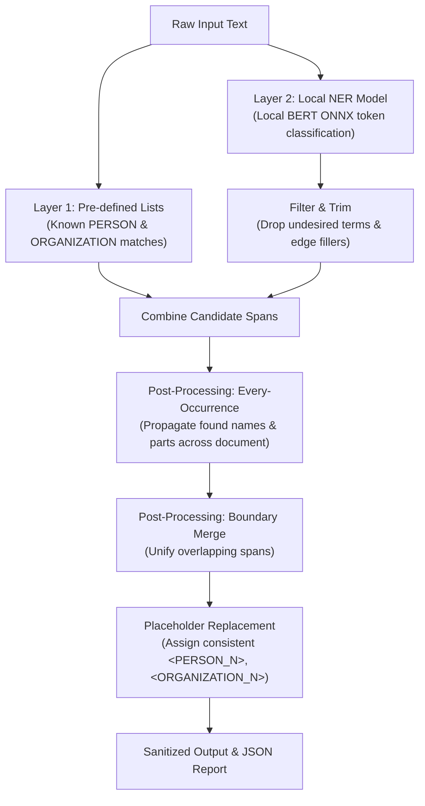

# PII Redaction with Pre-defined Lists and Transformers.js NER

A TypeScript pipeline that redacts people's names and listed company names
from English support transcripts, fully in-process: no Docker, no service and
no network at run time. Two independent detection layers, your pre-defined
lists and a small local NER model run through Transformers.js, find values;
their results are spread to every occurrence, merged, and replaced with
numbered placeholders such as `<PERSON_1>`. Redaction is one-way.

Part of the [PII de-identification implementations](https://github.com/Ahmed-Maher77/LLM-Privacy-Gateway___PII-De-identification-and-Re-identification#readme) collection.

## At a glance

| | |
| --- | --- |
| Language/runtime | TypeScript run with `tsx` on Node.js 20.9 or later; npm |
| Approach | Pre-defined lists plus a local BERT NER model (ONNX, CPU), then every-occurrence spreading, span merging and placeholders |
| Entities | `PERSON`; `ORGANIZATION` only for companies you list |
| Reversible | No. Placeholders are numbered and consistent within a document, but no mapping is kept |
| Network at runtime | None (internet needed only for `npm install` and the one-time model download) |
| Models | [`gravitee-io/bert-small-pii-detection`](https://huggingface.co/gravitee-io/bert-small-pii-detection), revision `f8c27a8`, Apache-2.0, 29 MB quantized ONNX |
| Best for | Offline redaction of names in English transcripts, where known customers, staff and companies can be listed in advance |
| Status | Working CLI and in-process library (v1.0.0); no automated tests, no HTTP service |

## Contents

- [Quick start](#quick-start)
- [Usage](#usage)
- [How it works](#how-it-works)
- [What gets redacted](#what-gets-redacted)
- [Pre-defined list](#pre-defined-list)
- [Undesired list (correctives)](#undesired-list-correctives)
- [NER model](#ner-model)
- [Measured numbers](#measured-numbers)
- [Testing and verification](#testing-and-verification)
- [Limitations](#limitations)
- [License](#license)

## Quick start

### Prerequisites

- Node.js 20.9 or later (required by `sharp`, a dependency of
  `@huggingface/transformers`) and npm.
- About 530 MB of disk for `node_modules/` (most of it ONNX Runtime binaries)
  and 29 MB for the model.
- Internet access for `npm install` and `npm run fetch:model`; none after that.

### Installation

```bash
npm install
cp .env.example .env     # optional: the defaults apply without it
npm run fetch:model      # once: downloads the pinned NER model into models/
```

On Windows, `cp` works in PowerShell and Git Bash; in `cmd.exe` use
`copy .env.example .env`.

`npm run fetch:model` downloads the pinned files from Hugging Face into
`models/` (git-ignored) and checks each one's SHA-256. Re-running it skips
files that are already present and intact.

### First run

```bash
npm run dev test_data/test.txt
```

This writes `reports/test__sanitized.txt` (the redacted text) and
`reports/test__report.json` (what was found), and prints the processing time
to stderr. npm runs the script from the project folder, so relative paths and
`reports/` resolve there.

## Usage

### CLI

```bash
npm run dev <file>
```

| Output | Content |
| --- | --- |
| `reports/<name>__sanitized<ext>` | The redacted text |
| `reports/<name>__report.json` | Input name and size, total and per-step timings and counts (`predefined`, `ner`, `repeat`, `merge`), and every detected span with its `value`, `type`, `score` and `source` |

The CLI never prints original values, but the JSON report lists every detected
value in plain text: treat it as sensitive (`reports/` is git-ignored). On any
error nothing is written.

| Exit code | Meaning |
| --- | --- |
| 0 | Done |
| 1 | No input file, file not found, or input over 2,000,000 characters; also an invalid `NER_MIN_SCORE`, `NER_WINDOW_TOKENS` or `NER_OVERLAP_TOKENS` (not a positive number), which fails at start-up with the error and its stack trace |
| 2 | The NER model is missing, unknown (`NER_MODEL`) or will not load (run `npm run fetch:model`), or a list file is missing or malformed |
| 3 | Unexpected error |

### npm scripts

| Script | What it does |
| --- | --- |
| `npm run dev <file>` | Redacts `<file>` (see above) |
| `npm run fetch:model` | Downloads and verifies the model named by `NER_MODEL`; `npm run fetch:model -- <org>/<name>` fetches another model registered in `src/utils/ner_utils/ner_models.ts` |
| `npm run typecheck` | `tsc --noEmit` |

### Library

There is no build step or package entry point; import the source from a
TypeScript project run with `tsx` (or your own TypeScript build):

```ts
import { redact, detect, InputTooLargeError } from "./src/pii/redact";
import { ModelLoadError } from "./src/pii/layers/ner";
import { ListError } from "./src/pii/layers/predefined";

const { text, spans, metrics } = await redact(input);
// text:  "Agent <PERSON_1> spoke to Mr <PERSON_2> of <ORGANIZATION_1>."
// spans: [{ start, end, type: "PERSON" | "ORGANIZATION", text, score?, source }, ...]

const found = await detect(input); // spans only
```

- `detect(text)` returns the spans: absolute UTF-16 offsets, sorted and
  non-overlapping. `source` is `"predefined"`, `"ner"` or `"repeat"`.
- `redact(text)` also returns the redacted `text` and per-step `metrics`.
- Inputs over 2,000,000 characters throw `InputTooLargeError`; a missing or
  broken model throws `ModelLoadError`; a missing or malformed list file
  throws `ListError`.
- The model loads on the first call and is reused, so later calls in the same
  process are much faster. Both lists are read once per process: restart it
  after editing them.
- `.env` is loaded from the current working directory; an invalid `NER_*`
  value throws when the module is first imported.

### Configuration

Settings are read once at start-up from the environment or `.env`
(git-ignored; see `.env.example`).

| Variable | Default | Notes |
| --- | --- | --- |
| `NER_MODEL` | `gravitee-io/bert-small-pii-detection` | Must be registered in `src/utils/ner_utils/ner_models.ts` and fetched |
| `NER_MIN_SCORE` | `0.5` | Name spans scored below it are dropped |
| `NER_WINDOW_TOKENS` | `384` | Model window in sub-tokens; values above 510 are capped at 510 |
| `NER_OVERLAP_TOKENS` | `32` | Sub-tokens two model windows share |
| `DESIRED_PREDEFINED_LIST` | `desired-predefined-list.json` | The desired list, in `config/` |
| `UNDESIRED_PREDEFINED_LIST` | `undesired-predefined-list.json` | The undesired list, in `config/` |

The model always uses half the logical CPUs as ONNX Runtime threads; this is
not configurable. The 2,000,000-character input limit is fixed.

## How it works


```mermaid
flowchart TD
    Input["Raw Input Text"] --> L1["Layer 1: Pre-defined Lists\n(Known PERSON & ORGANIZATION matches)"]
    Input --> L2["Layer 2: Local NER Model\n(Local BERT ONNX token classification)"]

    L2 --> Filter["Filter & Trim\n(Drop undesired terms & edge fillers)"]

    L1 --> Combine["Combine Candidate Spans"]
    Filter --> Combine

    Combine --> Repeat["Post-Processing: Every-Occurrence\n(Propagate found names & parts across document)"]
    Repeat --> Merge["Post-Processing: Boundary Merge\n(Unify overlapping spans)"]

    Merge --> Placeholder["Placeholder Replacement\n(Assign consistent &lt;PERSON_N&gt;, &lt;ORGANIZATION_N&gt;)"]

    Placeholder --> Output["Sanitized Output & JSON Report"]
```

1. **Pre-defined lists** match the names and companies you list, whole and in
   part.
2. **The NER model** labels the whole text in overlapping windows (nothing is
   truncated); only its PERSON labels are used. Its findings are trimmed of
   titles and fillers, filtered (score, acronyms, casing) and cleaned with the
   undesired list.
3. **Every occurrence** of a found value, and each part of a found name, is
   masked across the document.
4. **Overlapping spans are merged**, so nothing a layer found stays partly
   visible.
5. **Placeholders** `<TYPE_N>` replace each span.

The pipeline fails closed: if the model or a list file is missing, a setting is
invalid or the input is too large, the run stops with no output. Details,
design rules and how the settings were chosen:
[ARCHITECTURE.md](ARCHITECTURE.md).

## What gets redacted

`PERSON` (English names, and Arabic names written in English) and
`ORGANIZATION` (only the companies you list, see below).

Each value becomes a numbered placeholder, `<TYPE_N>`. Within one document the
same value always gets the same number. Different text is a different value,
so a first name used alone gets its own number:

```text
Hi, I'm Sarah Johnson from Acme.       ->  Hi, I'm <PERSON_1> from <ORGANIZATION_1>.
Thanks, Sarah. Bye, Sarah Johnson.     ->  Thanks, <PERSON_2>. Bye, <PERSON_1>.
```

Once a value is found, every other occurrence of the same text is masked too,
and so is each part of a found name ("Sarah" and "Johnson" alone after "Sarah
Johnson"). Lowercase common words are not spread this way: after the name
"hope" in a speech-to-text transcript, "i hope" stays as it is.

Everything else (emails, phone numbers, card numbers, IBANs, dates, ID
numbers, addresses, and so on) is left untouched by design: the scope is
`ENTITY_TYPES` in `src/pii/types.ts`.

## Pre-defined list

Names and companies you always want masked, whatever the model thinks, go in
`config/desired-predefined-list.json`:

```json
{
    "PERSON": ["Sarah Johnson", "Kofi Mensah"],
    "ORGANIZATION": ["Acme Corp", "Globex Corporation"]
}
```

The shipped list contains only `"Acme Corp"`. Each entry matches **whole** and
**in part**:

- **Whole:** case-insensitive, whole words, any whitespace between words.
- **Parts of a name:** each word of a multi-word `PERSON` entry is masked on
  its own, capitalised or in capitals ("Sarah", "SARAH"), even when the full
  name never appears. Lowercase parts ("kofi") match only on all-lowercase
  lines (speech-to-text), and only if they are not common words, so listing
  "Will Mensah" masks "Will" but not "i will call". Titles, particles and
  suffixes ("Mr", "al", "van", "Jr") are not parts.
- **Short company names:** an entry with a legal suffix also covers the short
  name: `"Acme Corp"` masks "Acme" and "ACME" too, but not the ordinary word
  "acme". List other short forms or abbreviations explicitly.

This is the most reliable way to cover names you know in advance (customers,
staff): the model misses some names ("Angela Osei", "Gerald Locke"),
especially in lowercase speech-to-text. **Companies are masked only from this
list**: automatic company detection mostly flagged products, acronyms and
headings.

## Undesired list (correctives)

Words and phrases the model wrongly takes for names go in
`config/undesired-predefined-list.json`, a plain array:

```json
["The", "Service", "Cart Service"]
```

They are never masked: a model finding equal to an entry is dropped, and
entry words at either end of a longer finding are trimmed ("The Sarah" ->
"Sarah"). Matching is case-insensitive and whole-word. List each wrong word
or the whole phrase: `["Lua"]` turns a finding "Redis Lua" into "Redis",
which stays masked.

Your pre-defined list still wins: a whole entry listed there is always
masked. The undesired list does apply to name parts (listing "The Rock" masks
"The Rock" and "Rock", and with "The" undesired, not "The" alone) and to the
every-occurrence step (an undesired word is never spread).

Both lists are read once per run, so each `npm run dev` picks up your edits.
On the labelled test set, listing the three words behind the model's false
positives ("Service", "Sarahville", "Cascadia") as correctives takes precision
from 98.2% to 100% with no loss of recall. A list file that is missing or
malformed stops the run (exit code 2).

## NER model

Names are found by
[`gravitee-io/bert-small-pii-detection`](https://huggingface.co/gravitee-io/bert-small-pii-detection)
(Apache-2.0, uncased BERT-small, 29 MB quantized ONNX), run on the CPU
through [Transformers.js](https://huggingface.co/docs/transformers.js)
(`@huggingface/transformers` 4.3.0). Only its PERSON labels are used. The
model is **not** part of this repository: `npm run fetch:model` downloads it
once from Hugging Face into `models/`, pinned to revision `f8c27a8` and
checked by SHA-256. Remote model loading is disabled at run time.

## Measured numbers

Measured on 2026-09-30. Neither table can be reproduced with tooling in this
repository (see [Testing and verification](#testing-and-verification)).

### Accuracy

On the 10 hand-labelled synthetic transcripts in `test_data/` (labels in
`test_data/labels/`), with the shipped list (only `"Acme Corp"`), compared
with the earlier 4-layer version of this pipeline (pre-defined list, name
registries, regex, NER, wink-nlp; published as
[`04-ts-multilayer-lists-regex-ner-winknlp`](https://github.com/Ahmed-Maher77/LLM-Privacy-Gateway___PII-De-identification-and-Re-identification/tree/04-ts-multilayer-lists-regex-ner-winknlp)),
scored on names and companies only:

| | This pipeline | Previous pipeline |
| --- | --- | --- |
| Names and companies found | 98.5% (390 / 396) | 99.0% (392 / 396) |
| Characters leaked | 0.9% | 0.5% |
| Precision (false positives) | 98.2% (7) | 97.5% (10) |
| Over-masked characters | 65 | 73 |
| Names found, normally cased files | 98.9% | 99.7% |
| Name characters leaked, lowercase speech-to-text | 2.8% | 4.3% |

The names found before and missed now (including "Angela Osei" and "Gerald
Locke") were found only by the name registries, which are gone; the model
labels them as not a name at any threshold. Listing those names plus "Will
Mensah" in the pre-defined list gives 99.5% found, 0.2% leaked, 96.8%
precision: that is the intended way to close the gap. The set is small and
synthetic; see [LIMITATIONS.md](LIMITATIONS.md) for the full breakdown.

### Speed and memory

On an 8-core laptop, median of 5 runs. _Cold_ is the first call in a new
process, as in one CLI run, including loading the model; _warm_ is a later
call in the same process, as in library use.

| Input | Cold | Warm | Peak memory |
| --- | --- | --- | --- |
| 6 KB | 0.93 s | 0.19 s | 0.30 GB |
| 60 KB | 3.3 s | 3.3 s | 0.33 GB |
| 229 KB | 12.8 s | 10.3 s | 0.32 GB |

The 60 KB and 229 KB figures were measured with the CPU busy with other work;
the 4-layer pipeline measured 8.6 s cold / 7.0 s warm at 229 KB under lighter
load, and the tuning session in [ARCHITECTURE.md](ARCHITECTURE.md) measured
5.2 s warm. For large files the NER model is almost all of the time. At 6 KB
the 4-layer pipeline measured 1.4 s cold / 0.45 GB: its name registries (7 MB
of text) cost about 0.5 s to load and 0.15 GB. `npm run dev` adds about 1.7 s
of `npm` and `tsx` start-up on top of _cold_. Measure on the production
machine before relying on these figures.

## Testing and verification

There is no unit test suite and no evaluation script. What exists:

| Check | Command |
| --- | --- |
| Type check | `npm run typecheck` |
| Model files present and intact (SHA-256) | `npm run fetch:model` (skips intact files, downloads missing ones) |
| Manual run on synthetic data | `npm run dev test_data/<file>.txt`, then inspect `reports/` |

`test_data/` holds 12 synthetic transcripts, 10 of them with hand-made labels
in `test_data/labels/` (`test.txt` and `sme_trans_2.txt` are unlabelled). At
run time the NER layer fails the run if any span's offsets do not match the
input text or any part of the input was left unlabelled.

## Limitations

- Only `PERSON` and listed `ORGANIZATION` values are masked; all other PII
  passes through.
- English only; Arabic script is not detected.
- Names the model does not know are missed unless listed; lowercase
  speech-to-text is the weak spot.
- Every-occurrence spreading over-masks capitalised words that are also names.
- Redaction is one-way, and the JSON report holds the original values in plain
  text.
- Whole document in memory, 2,000,000-character limit; CLI and library only,
  no HTTP service.

Full list, measured breakdown and rule trade-offs:
[LIMITATIONS.md](LIMITATIONS.md).

## License

MIT — see [LICENSE](LICENSE).
