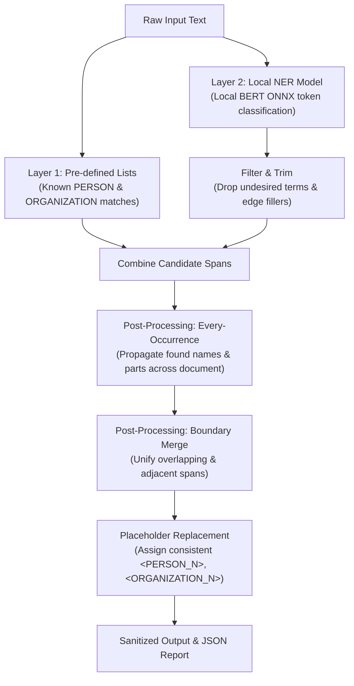

# PII Detection & Redaction Pipeline

English-language name and company redaction for support transcripts, fully
in-process: no Docker, no service, no network at run time. Two detection
layers — your pre-defined lists and a local NER model (Transformers.js) —
find values; their results are merged and masked. How it works: [ARCHITECTURE.md](ARCHITECTURE.md). Known drawbacks:
[LIMITATIONS.md](LIMITATIONS.md).

## Pipeline Architecture


```mermaid
flowchart TD
    Input["Raw Input Text"] --> L1["Layer 1: Pre-defined Lists\n(Known PERSON & ORGANIZATION matches)"]
    Input --> L2["Layer 2: Local NER Model\n(Local BERT ONNX token classification)"]
    
    L2 --> Filter["Filter & Trim\n(Drop undesired terms & edge fillers)"]
    
    L1 --> Combine["Combine Candidate Spans"]
    Filter --> Combine
    
    Combine --> Repeat["Post-Processing: Every-Occurrence\n(Propagate found names & parts across document)"]
    Repeat --> Merge["Post-Processing: Boundary Merge\n(Unify overlapping & adjacent spans)"]
    
    Merge --> Placeholder["Placeholder Replacement\n(Assign consistent &lt;PERSON_N&gt;, &lt;ORGANIZATION_N&gt;)"]
    
    Placeholder --> Output["Sanitized Output & JSON Report"]
```

## What gets redacted

`PERSON` (English names, and Arabic names written in English) and
`ORGANIZATION` (only the companies you list, see below).

Each value becomes a numbered placeholder, `<TYPE_N>`. Within one document the
same value always gets the same number. Different text is a different value,
so a first name used alone gets its own number:

```text
Hi, I'm Sarah Johnson from Acme.       ->  Hi, I'm <PERSON_1> from <ORGANIZATION_1>.
Thanks, Sarah. Bye, Sarah Johnson.     ->  Thanks, <PERSON_2>. Bye, <PERSON_1>.
```

Once a value is found, every other occurrence of it is masked too, and so is
each part of a found name ("Sarah" and "Johnson" alone after "Sarah Johnson").
Lowercase common words are not spread this way: after the name "hope" in a
speech-to-text transcript, "i hope" stays as it is.

Everything else (emails, phone numbers, card numbers, IBANs, dates, ID
numbers, addresses, …) is left untouched by design: the scope is
`ENTITY_TYPES` in `src/pii/types.ts`.

## Pre-defined list

Names and companies you always want masked, whatever the model thinks, go in
`config/desired-predefined-list.json`:

```json
{
    "PERSON": ["Sarah Johnson", "Kofi Mensah"],
    "ORGANIZATION": ["Acme Corp", "Globex Corporation"]
}
```

Each entry matches **whole** and **in part**:

- **Whole:** case-insensitive, whole words, any whitespace between words.
- **Parts of a name:** each word of a multi-word `PERSON` entry is masked on
  its own, capitalised or in capitals ("Sarah", "SARAH"), even when the full
  name never appears. Lowercase parts ("kofi") match only on all-lowercase
  lines (speech-to-text), and only if they are not common English words, so
  listing "Will Mensah" masks "Will" but not "i will call". Titles, particles
  and suffixes ("Mr", "al", "van", "Jr") are not parts.
- **Short company names:** an entry with a legal suffix also covers the short
  name: `"Acme Corp"` masks "Acme" and "ACME" too, but not the
  ordinary word "acme". List other short forms or abbreviations
  explicitly.

This is the most reliable way to cover names you know in advance (customers,
staff): the model misses some names ("I am Shankar."), especially in
lowercase speech-to-text. **Companies are masked only from this list**:
automatic company detection mostly flagged products, acronyms and headings.

## Undesired list (correctives)

Words and phrases the model wrongly takes for names go in
`config/undesired-predefined-list.json`, a plain array:

```json
["The", "Service", "Cart Service"]
```

They are never masked: a model finding equal to an entry is dropped, and
entry words at either end of a longer finding are trimmed ("The Sarah" →
"Sarah"). Matching is case-insensitive and whole-word. List each wrong word
or the whole phrase: `["Lua"]` turns a finding "Redis Lua" into "Redis",
which stays masked.

Your pre-defined list still wins: a whole entry listed there is always
masked. The undesired list does apply to name parts (listing "The Rock"
masks "The Rock" and "Rock", and with "The" undesired, not "The" alone) and
to the every-occurrence step (an undesired word is never spread).

Both lists are read once per run, so each `npm run dev` picks up your edits
(in library use, restart the process after editing). On the test set,
the three false positives the model makes ("Service", "Sarahville",
"Cascadia") as correctives take precision from 98.2% to 100% with no loss of
recall. A list file that is missing or malformed stops the run (exit code 2).

## NER model

Names are found by
[`gravitee-io/bert-small-pii-detection`](https://huggingface.co/gravitee-io/bert-small-pii-detection)
(Apache-2.0, 29 MB quantized ONNX), run on the CPU through
[Transformers.js](https://huggingface.co/docs/transformers.js). Only its
PERSON labels are used. The model is **not** part of this repository:
`npm run fetch:model` downloads it once from Hugging Face into `models/`
(git-ignored), pinned to one revision and checked by SHA-256.

## Running it

```bash
npm install
cp .env.example .env           # optional: copy default configuration
npm run fetch:model            # once: downloads pinned NER model into models/ (needs internet)
npm run dev <file>             # writes reports/<name>__sanitized<ext> and reports/<name>__report.json
npm run typecheck              # verify TypeScript types
```

After the fetch, runs need no network. The CLI writes only the **redacted**
text and never prints original values. Exit codes:

| Code | Meaning |
| --- | --- |
| 0 | done |
| 1 | no input file, file not found, or input over 2,000,000 characters; also an invalid `NER_*` value in `.env` (rejected at start-up with its message) |
| 2 | the NER model is missing or won't load (run `npm run fetch:model`), or a list file is missing or malformed |
| 3 | unexpected error |

On any error nothing is written.

## Configuration

Read once at startup; `.env` is loaded and git-ignored (see `.env.example`).

| Variable            | Default                                | Notes                                                        |
| ------------------- | -------------------------------------- | ------------------------------------------------------------ |
| `NER_MODEL`         | `gravitee-io/bert-small-pii-detection` | must be listed in `src/utils/ner_utils/ner_models.ts` and fetched |
| `NER_MIN_SCORE`     | `0.5`                                  | name spans scored below it are dropped                       |
| `NER_WINDOW_TOKENS` | `384`                                  | model window in sub-tokens, at most 510                      |
| `NER_OVERLAP_TOKENS` | `32`                                  | sub-tokens two model windows share                           |
| `DESIRED_PREDEFINED_LIST` | `desired-predefined-list.json`   | the desired list, in `config/`                               |
| `UNDESIRED_PREDEFINED_LIST` | `undesired-predefined-list.json` | the undesired list, in `config/`                           |

The model always uses half the logical CPUs as onnxruntime threads; this is
not configurable.

## Library use

```ts
import { redact, detect } from "./src/pii/redact";

const { text, spans } = await redact(input);
```

`detect()` returns the spans only: absolute UTF-16 offsets, sorted and
non-overlapping. Inputs over 2,000,000 characters throw `InputTooLargeError`;
a missing or broken model throws `ModelLoadError`, and a missing or malformed
list file `ListError` (from `./src/pii/layers/predefined`). The model loads on the
first call and is reused, so later calls in the same process are much faster.

## Measured numbers (2026-09-30)

On 10 hand-labelled synthetic transcripts (`test_data/`), with the
shipped list (only `"Acme Corp"`), against the previous 4-layer pipeline
(pre-defined list, name registries, regex, NER, wink-nlp) scored on names and
companies only:

|                                                  | This pipeline     | Previous pipeline |
| ------------------------------------------------ | ----------------- | ----------------- |
| Names and companies found                        | 98.5% (390 / 396) | 99.0% (392 / 396) |
| Characters leaked                                | 0.9%              | 0.5%              |
| Precision (false positives)                      | 98.2% (7)         | 97.5% (10)        |
| Over-masked characters                           | 65                | 73                |
| Names found, normally cased files                | 98.9%             | 99.7%             |
| Name characters leaked, lowercase speech-to-text | 2.8%              | 4.3%              |

The 3 names found before and missed now ("Angela Osei", "Gerald Locke",
"Shankar") were found only by the name registries, which are gone; the model
labels them as not a name at any threshold. Listing those three plus "Will
Mensah" in the pre-defined list gives 99.5% found, 0.2% leaked, 96.8%
precision: that is the intended way to close the gap. The
set is small and synthetic; see [LIMITATIONS.md](LIMITATIONS.md).

Speed on an 8-core laptop (median of 5; _cold_ = the first call in a new
process, as in one CLI run, including loading the model; _warm_ = a later
call in the same process, as in library use):

| Input  | Cold   | Warm   | Peak memory |
| ------ | ------ | ------ | ----------- |
| 6 KB   | 0.93 s | 0.19 s | 0.30 GB     |
| 60 KB  | 3.3 s  | 3.3 s  | 0.33 GB     |
| 229 KB | 12.8 s | 10.3 s | 0.32 GB     |

The 4-layer pipeline measured 1.4 s cold / 0.45 GB at 6 KB: the name
registries (7 MB of text) cost about 0.5 s to load and 0.15 GB. For large
files the NER model is almost all of the time and is unchanged; the larger
figures above were measured with the CPU busy with other work (the 4-layer
pipeline measured 8.6 s cold / 7.0 s warm at 229 KB under lighter load).
Measure on the production machine before relying on these. `npm run dev`
adds about 1.7 s of `npm` and `tsx` start-up on top of _cold_.