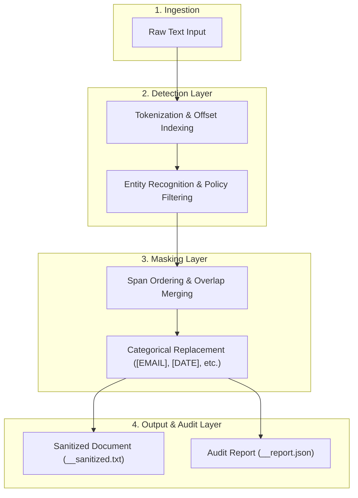

# WinkNLP Lite PII Masker

A small Node.js and TypeScript library and script that finds and masks personally identifiable information (PII) in plain text. It uses [`wink-nlp`](https://winkjs.org/wink-nlp/) with the [`wink-eng-lite-web-model`](https://www.npmjs.com/package/wink-eng-lite-web-model). It exposes two functions. `detectPII` returns typed spans with exact character offsets, and `maskPII` replaces those spans with one-way `[TYPE]` placeholders. The included runner writes a sanitized copy of the input and a JSON detection report. Everything runs offline, and the model ships inside the npm package.

Part of the [PII de-identification implementations](https://github.com/Ahmed-Maher77/LLM-Privacy-Gateway___PII-De-identification-and-Re-identification#readme) collection.

## At a glance

| | |
|---|---|
| **Language/runtime** | TypeScript (ES modules) on Node.js 22+ |
| **Approach** | Entity recognition with wink-nlp, filtered by a per-type configuration |
| **Entities** | Detected: `EMAIL`, `URL`, `DATE`, `TIME`, `MONEY`, `MENTION` (`EMAIL`, `URL` and `DATE` are on by default) |
| **Reversible** | No. Spans are replaced with one-way `[TYPE]` placeholders |
| **Network at runtime** | None (`npm install` needs the npm registry) |
| **Models** | `wink-eng-lite-web-model` 1.8.x (English, bundled in the npm package, about 3.8 MB) |
| **Best for** | Lightweight offline masking of emails, URLs, dates, times, amounts of money and @-mentions in English text, or a first-pass layer in a larger pipeline |
| **Status** | Working prototype with 11 passing unit tests. No command-line options yet |

## Contents

- [Quick start](#quick-start)
- [Usage](#usage)
- [How it works](#how-it-works)
- [Project structure](#project-structure)
- [Testing](#testing)
- [Limitations](#limitations)
- [License](#license)

## Quick start

### Prerequisites

- [Node.js](https://nodejs.org/) 22 or later. `npm test` needs Node's built-in test-file globbing, which arrived in Node 21.
- npm

### Installation

```bash
npm install
```

### First run

```bash
npm run dev
```

This processes the synthetic fixture `test_data/mockup_interview.txt`. It prints the original text, each detected span and a summary, then writes two files:

- `reports/mockup_interview__sanitized.txt`: the masked text
- `reports/mockup_interview__report.json`: detection time, span counts by type and source, and every detected span with its offsets

## Usage

### Scripts

| Command | What it does |
|---|---|
| `npm run dev` | Runs `src/index.ts` with `tsx` against the hard-coded input `test_data/mockup_interview.txt`, using the configuration defined in that file |
| `npm run build` | Compiles `src/` to JavaScript in `dist/`, with type declarations and source maps |
| `npm test` | Runs the unit tests in `test/` with Node's test runner through `tsx` |

The runner takes no command-line arguments. To process another file, or to use a different configuration, edit `inputPath` and `config` in [`src/index.ts`](src/index.ts).

Output files go to `reports/` in the current working directory and are named `reports/<name>__sanitized<ext>` and `reports/<name>__report.json`. The `reports/` folder is gitignored.

To run the compiled build with plain Node, build first and then run from the project root:

```bash
npm run build
node dist/index.js
```

### Library API

```typescript
import { detectPII, maskPII } from "./src/pii-masker.js";

const text = "Contact John Doe at john.doe@example.com before tomorrow.";

// 1. Detect PII; the config given here is merged over the defaults
const matches = detectPII(text, {
  EMAIL: true,
  DATE: true,
});

console.log(matches);
// [
//   { type: 'EMAIL', value: 'john.doe@example.com', start: 20, end: 40, source: 'wink-nlp' },
//   { type: 'DATE', value: 'tomorrow', start: 48, end: 56, source: 'wink-nlp' }
// ]

// 2. Mask the detected spans (matches first, then text)
const sanitized = maskPII(matches, text);
console.log(sanitized);
// "Contact John Doe at [EMAIL] before [DATE]."
```

The example imports from the TypeScript source, so run it with `npx tsx`. After `npm run build`, plain Node can import the same functions from `./dist/pii-masker.js`. The package `main` field (`dist/index.js`) points to the runner script, not to the library. Import `pii-masker` directly.

Signatures (from [`src/pii-masker.ts`](src/pii-masker.ts) and [`src/types.ts`](src/types.ts)):

```typescript
function detectPII(text: string, config?: PIIMaskConfig): PIIMatch[];
function maskPII(matches: PIIMatch[], text: string): string;

type PIIMaskConfig = Partial<Record<PIIType, boolean>>;
interface PIIMatch { type: PIIType; value: string; start: number; end: number; source?: string }
```

`start` and `end` are character offsets into the original string, so `text.slice(start, end) === value`.

### Configuration

Each `PIIMaskConfig` key turns one entity type on or off. Only the types that `wink-eng-lite-web-model` recognizes are actually detected:

| Entity type | Description | Default | Placeholder |
|---|---|:---:|---|
| `EMAIL` | Email addresses | On | `[EMAIL]` |
| `URL` | Web links and domain references | On | `[URL]` |
| `DATE` | Calendar dates and relative day references (for example "tomorrow") | On | `[DATE]` |
| `MENTION` | Social media handles and @-mentions | Off | `[MENTION]` |
| `TIME` | Times of day and time expressions | Off | `[TIME]` |
| `MONEY` | Currency values and monetary expressions | Off | `[MONEY]` |

`PIIMaskConfig` also accepts `PHONE`, `PERSON`, `LOCATION`, `ORGANIZATION` and `IP_ADDRESS`. The model does not produce these entity types, so turning them on currently has no effect. The model emits other types that are not PII, such as `CARDINAL`, and these are always ignored.

## How it works


```mermaid
flowchart TD
    subgraph S1["1. Ingestion"]
        A["Raw Text Input"]
    end

    subgraph S2["2. Detection Layer"]
        B["Tokenization & Offset Indexing"]
        C["Entity Recognition & Policy Filtering"]
        B --> C
    end

    subgraph S3["3. Masking Layer"]
        D["Span Ordering & Overlap Merging"]
        E["Categorical Replacement ([EMAIL], [DATE], etc.)"]
        D --> E
    end

    subgraph S4["4. Output & Audit Layer"]
        F["Sanitized Document (__sanitized.txt)"]
        G["Audit Report (__report.json)"]
    end

    A --> B
    C --> D
    E --> F
    E --> G
```

1. **Ingestion.** The pipeline reads unstructured plain text, such as conversation logs and transcripts.
2. **Detection** (`detectPII`):
   - **Tokenization and offset indexing.** wink-nlp splits the text into tokens. In a single O(N) pass, each token is anchored back onto the original string to get exact start and end character offsets. This keeps offsets correct even where wink-nlp drops or normalizes characters, such as a byte-order mark, U+2028, `\v` or `\f`.
   - **Entity recognition and policy filtering.** The named entities found by the model are mapped to character spans. Each one is kept only if its type is turned on in the merged configuration.
3. **Masking** (`maskPII`):
   - **Span ordering and overlap merging.** Spans are sorted by start offset, with the longer span first when two start at the same offset. A span that overlaps the previous one joins that mask, and the mask grows to cover the furthest end. The text is never corrupted, and no part of an overlapping span is left visible.
   - **Categorical replacement.** Each span is replaced with a bracketed placeholder for its type, such as `[EMAIL]`, `[DATE]` or `[URL]`. The original values are not stored anywhere.
4. **Output and audit.** The runner writes the sanitized text and a JSON report. The report contains the input file name and character count, the path of the sanitized file, the detection time in milliseconds, totals by type and by source, and every span with its value and offsets.

## Project structure

```
├── src/
│   ├── generate_reports/
│   │   ├── writeJsonReport.ts        # Builds and writes the JSON detection report
│   │   ├── writeReportFile.ts        # Shared reports/ path naming and file writing
│   │   └── writeSanitizedReport.ts   # Writes the masked text to reports/
│   ├── index.ts                      # Runner script (hard-coded input and config)
│   ├── pii-masker.ts                 # detectPII and maskPII
│   └── types.ts                      # PIIType, PIIMatch, PIIMaskConfig, JsonReportInput
├── test/
│   └── pii-masker.test.ts            # Unit tests (Node test runner via tsx)
├── test_data/
│   └── mockup_interview.txt          # Synthetic multi-format transcript fixture
├── .gitattributes                    # Line-ending normalization
├── .gitignore                        # Ignores node_modules/, dist/, reports/ and local inputs
├── LICENSE                           # MIT license
├── package.json                      # Scripts and dependencies
├── package-lock.json                 # Locked dependency versions
└── tsconfig.json                     # TypeScript build configuration
```

## Testing

```bash
npm test
```

The suite has 11 tests, all in `test/pii-masker.test.ts`. They cover:

- empty input
- exact character offsets
- not matching inside longer words
- configuration filtering
- repeated entities
- masking
- fully and partially overlapping spans
- input that starts with a byte-order mark
- the report writers

The report-writer test writes to `reports/`, and this overwrites `reports/mockup_interview__sanitized.txt` and `reports/mockup_interview__report.json`. Run `npm run dev` again to regenerate them.

[`test_data/mockup_interview.txt`](test_data/mockup_interview.txt) is a synthetic transcript that mixes emails, dates, money, phone numbers, IDs and international formats. Only the entity types listed under [Configuration](#configuration) are detected and masked. With the runner's configuration, the fixture produces 14 spans: 8 emails, 5 dates and 1 mention. All test data is synthetic and contains no real personal information.

## Limitations

- **Narrow entity coverage.** Names, phone numbers, postal addresses, IP addresses, national IDs, card numbers and IBANs are not detected. The configuration accepts `PERSON`, `LOCATION`, `ORGANIZATION`, `PHONE` and `IP_ADDRESS`, but the model never emits them.
- **One-way only.** Placeholders are generic and not numbered, and no mapping is kept, so masked text cannot be re-identified.
- **English model.** `wink-eng-lite-web-model` targets English text.
- **No command-line interface.** The runner's input path and configuration are hard-coded in `src/index.ts`.
- **Package entry point.** `main` points to the runner script, so the library has to be imported from `pii-masker` directly.
- **No published benchmarks.** The report records detection time for each run, but no performance figures are documented.

## License

MIT. See [LICENSE](LICENSE).
