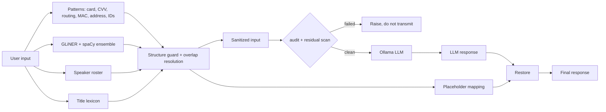

# LLM Privacy Gateway: PII De-identification and Re-identification

Protect personally identifiable information (PII) before sending text to an
LLM, then restore the original values in the response. Text is scanned by four
complementary detectors, every match is replaced by a stable placeholder, and
**two independent verification passes** run before anything leaves the machine.

## Flow


```mermaid
flowchart LR
  A[User input] --> B[Patterns: card, CVV, routing, MAC, address, IDs]
  A --> C[GLiNER + spaCy ensemble]
  A --> D[Speaker roster]
  A --> E[Title lexicon]
  B --> F[Structure guard + overlap resolution]
  C --> F
  D --> F
  E --> F
  F --> G[Sanitized input]
  F --> H[Placeholder mapping]
  G --> V{audit + residual scan}
  V -->|failed| X[Raise, do not transmit]
  V -->|clean| I[Ollama LLM]
  I --> J[LLM response]
  J --> K[Restore]
  H --> K
  K --> L[Final response]
```

## Verification: why there are two passes

The two checks have opposite blind spots, and only having both makes a clean
result mean anything:

| | `audit()` | `scan_residual()` |
| --- | --- | --- |
| Question | "did everything we detected get removed?" | "does anything secret-shaped remain?" |
| Input | detected surface forms + roster | the sanitized text alone |
| Blind to | anything never detected | anything without a recognizable shape |

`audit()` cannot find a MAC address no detector saw. `scan_residual()` cannot
find the name "Sarah" surviving in prose.

Results carry a three-state `status`, not a boolean:

| status | meaning | exit code |
| --- | --- | --- |
| `clean` | both passes agree | 0 |
| `review` | medium-confidence shapes nobody has triaged | 0, or 4 under `--strict` |
| `failed` | PII survived; **do not transmit** | 3 |

```python
result = middleware.analyze(text)     # raises LeakDetected by default
response = llm.invoke(result.sanitized)
final = middleware.restore_for(response.content, result)
```

Enforcement lives in `analyze()`, not in callers — `on_leak` chooses the mode
(`raise` / `warn` / `ignore`) but every caller is covered by default.

## Evidence, not enumeration

The redactor used to decide what was a name by asking whether a word appeared
in one of seven hand-written lists. Those lists reached 480 entries and still
failed on every unseen document, because vocabulary is open and lists are not.

Those judgements are now computed from the document and the models already
loaded:

| Signal | Replaces |
| --- | --- |
| A name begins and ends on a capitalised token | "Dubai warehouse", "Three workers" |
| A run of two or more spaces is a column boundary | the fixed-width layout bug below |
| The document also writes the word in lower case (in prose, not inside an identifier) | a list of common words |
| Short all-caps token ⇒ acronym, not a company | SME, CASB, SIEM, DLP, CFO |
| Part-of-speech from the spaCy pass already running | NOUN and NUM are not names |
| A `Label:` whose values are short is a form field; one followed by sentences is a speaker | `Owner:` vs `Sarah Jenkins:` |
| A single-token person needs corroboration — a full name, honorific, speaker line or email address | masking every capitalised word |

### Why span edges are normalised first

Boundary drift is not cosmetic. It compounds:

```
source:  - Dr. Samuel Adeyemi       Oncology Lead, Sub-Saharan Africa
span:         "Samuel Adeyemi       Oncology"
```

Coreference then read "Oncology" as a token of that full name, folded a medical
specialty and a person into one identity, and the vault — which used to keep
the longest surface form — bound the placeholder to the wrong value. Restoring
the other mention emitted `(Samuel Adeyemi Oncology)` and the witness's name
was destroyed.

So edges are tightened before anything derives identity from a span's text, and
the canonical form is chosen by well-formedness rather than by length. Either
fix alone would have prevented the data loss; both are in place.

## Detection layers

| Layer | Handles | Why |
| --- | --- | --- |
| **Patterns** | card, CVV, expiry, routing, account, IBAN, SWIFT/BIC, EU VAT, SSN, email, URL, IP, MAC, address (US + UK), labelled IDs, connection strings, bearer tokens, secret assignments | Exact and explainable |
| **Models** | people, organizations, locations, addresses, job titles | GLiNER is multilingual and PII-trained; spaCy adds recall on short names |
| **Roster** | every mention of a known participant | Speaker labels give a reliable roster, so shorthand mentions match deterministically |
| **Lexicon** | job and meeting titles | Detected so they outrank `ORG`, then left unredacted |

### Checksums grade, they do not gate

A Luhn check is a **precision filter that costs recall**, and a card number with
a transcription typo is still a card number. Gating on it is exactly why
`4532-0192-8834-5610` (Luhn-invalid) and `122000049` (ABA-invalid) leaked.

Now the checksum contributes to a score alongside digit grouping, issuer prefix
and keyword adjacency. The only shape that falls below threshold is a bare,
unchecksummed, contextless digit run — which is indistinguishable from an
ordinary long number.

### A credential-bearing URI is one secret, not several

`postgresql://admin_user:P@ssw0rd2026!@10.0.4.15:5432/production_db` used to be
shredded: the email rule claimed `ssw0rd2026!@10.0.4.15`, leaving `P@` and the
username in cleartext and filing a database password under "contact details".

Two fixes. A `CONNECTION_STRING` rule matches the whole URI at top precedence
so no other rule gets a bite, and its user-info group is greedy to the **last**
`@` because passwords contain `@`. And `EMAIL` now requires an alphabetic final
label, so an IP address can no longer pose as a domain.

### Keyword-anchored rules redact the value, not the label

`CVV`, `expires`, `routing number` and `account number` rules capture the secret
in group 1, so the keyword stays readable and the value disappears. Previously
the reverse happened: the word "CVV" was masked and `482` was not.

## Structure preservation

JSON and code blocks stay syntactically intact while PII inside them is still
redacted:

```json
"mac_address": "{{MAC_ADDRESS_1}}"
```

- Regions are found by **brace balance, not fences** — a real transcript's JSON
  block is introduced by a bare line reading `JSON` with no backticks.
- Schema **keys** are never masked for `ORG`/`LOCATION`/title types. A `PERSON`
  or structured span in a key position is clipped rather than dropped, because
  a key named `"sarah_jenkins"` is real data and "keys are never redacted"
  would be a free exfiltration channel.
- Delimiter clipping applies **only inside detected regions** and **never to
  pattern spans** — a MAC address legitimately contains five colons, and prose
  is full of commas.

## Redaction profiles

| Profile | Redacts |
| --- | --- |
| `balanced` (default) | people and all structured identifiers |
| `strict` | adds organizations and locations |
| `minimal` | structured identifiers only |

ORG and LOCATION were 20% of everything redacted and the source of nearly every
over-redaction — `SOC 2`, `SonarQube`, `CloudTrail`, `Shadow IT`, `Cortana`,
`Microsoft Teams`, four human languages, three nationalities. An employer or a
city is quasi-identifying at most, and chasing that vocabulary with an
allowlist never converges.

Three things are redacted regardless of profile, because dropping them with the
rest would have been a quiet downgrade of protection:

- **`NORP`** — nationality, ethnicity, religion, political affiliation. This is
  special-category data, and it was previously mapped into `LOCATION`.
- **Eponymous organizations** — an org sharing a name token with a person.
  Printing `{{PERSON_1}}, Esq. (Partner, Whitfield & Barnes)` puts the surname
  one token from its own placeholder and defeats the redaction outright. Law
  firms, medical practices and single-member companies are a large class.
- **Placeholder literals** — the injection defence.

`JOB_TITLE` and `MEETING_TITLE` are detected under every profile and redacted
under none. Products, compliance terms and card brands (`github`, `chrome`,
`IP`, `MAC`, `CVV`, `PCI`, `DSS`, `VAT`, `SWIFT`, `BIC`, `Microsoft Teams`,
`Master Card`) are allowlisted **token-wise**, so multi-word names match --
this is what stops `PCI-DSS` being mangled into `{{ORG_5}}-DSS`. Allowlisting
the word `SWIFT` does not suppress an actual BIC code, because pattern spans
are exempt from the allowlist. Allowlisting `mac` never suppresses an actual MAC address, because
pattern spans are exempt from the allowlist.

## Security properties

- **Placeholder injection is closed.** A document containing the literal
  `{{PERSON_1}}` used to make `restore()` splice a real name into
  attacker-controlled text. Such literals are now neutralized to an inert
  sentinel that cannot match the placeholder grammar even if a model
  re-brackets it. Reversible via `restore_for()`, but only *after* the
  placeholder pass — that ordering is the security property.
- **Restoration is narrowed to minted tokens.** A response containing
  `<SECTION_1>` or `${DB_1}` is left alone rather than re-identified.
- **Reports carry no PII by default.** No `mapping`, no restored `result`, and
  `leaks[].value` replaced by a masked preview plus a **salted** digest — an
  unsalted SHA-256 of an SSN is brute-forceable in about a second. The
  sanitized text is withheld entirely when status is `failed`, so the report
  cannot become the delivery vehicle for the leak it reports.
- **Fail-closed means do not transmit.** `generate_report.py` skips the LLM
  call on a failed verification; exiting non-zero *after* sending data to a
  third party is a postmortem, not a control.
- **Degradation is visible.** A missing spaCy model warns and is recorded in
  `report["detectors"]`; a clean run without it is a weaker claim.

### Residual risk, stated plainly

Escaping the input removes the *forgery* vector. It does not remove *misuse*: a
prompt-injected model can still be steered into emitting a legitimate
`{{EMAIL_1}}` inside an attacker-chosen URL. **Restored text is untrusted** —
do not auto-render links or auto-execute anything from it.

`chmod 0o600` is close to advisory on Windows, this project's home platform.
The control that bites there is the parent directory ACL:

```powershell
icacls reports /inheritance:r /grant:r "%USERNAME%":(OI)(CI)F
```

## Custom patterns

Organisation-specific ID formats load from an optional `pii_patterns.toml`
(stdlib `tomllib`, no new dependency). See `pii_patterns.toml.example`.
Declared `examples`/`counter_examples` are asserted at load time, turning a
typo that makes a rule match nothing into a startup failure.

```bash
cp pii_patterns.toml.example pii_patterns.toml
# or
export PII_PATTERNS_CONFIG=/etc/pii/patterns.toml
```

## Prerequisites

- Python 3.12 or newer
- [uv](https://docs.astral.sh/uv/)
- [Ollama](https://ollama.com/) running locally with the model used by `main.py`

## Installation

```bash
uv sync
uv run python -m spacy download en_core_web_lg
```

The first run downloads `urchade/gliner_multi_pii-v1`. The spaCy model is
optional; without it the ensemble falls back to GLiNER alone, warns, and
records the reduced coverage in the report.

## Usage

```bash
uv run python main.py

uv run python generate_report.py test_data/transcript_test.txt --skip-llm
uv run python generate_report.py test_data/transcript_test.txt --strict --explain
uv run python generate_report.py test_data/transcript_test.txt --include-secrets
```

`--skip-llm` verifies without calling the LLM. `--explain` prints every residual
finding including suppressed ones, so "why wasn't X flagged?" is answerable.
`--include-secrets` writes real PII and warns loudly; that file must not be
committed.

## Measuring whether it generalises

Three earlier rounds of fixes each repaired the newest transcript and regressed
an older one, because there was nothing measuring across documents. Scoring is
now tiered, cheapest first.

**Tier 1 -- the substring gate.** Did every `must_redact` value disappear and
every `must_keep` value survive? Cheap to read and write, and a leak here is
the one unconditional failure. It cannot see anything outside those lists,
which is why it is a gate and not the headline: on the twelve production
fixtures the pipeline redacted 112 entities while the labels covered 71, and
precision still printed 100%.

**Tier 2 -- entity-level, the headline.** Every span the pipeline actually
replaced is aligned against offset-anchored gold, giving micro precision,
recall and F1 per label plus the specific false redactions behind the number.

```bash
uv run python tools/evaluate.py                     # score every fixture
uv run python tools/evaluate.py --select "prod_*"   # one family
uv run python tools/evaluate.py --show-fp 0         # every false redaction
uv run python tools/evaluate.py --triage            # queue unlabelled predictions
uv run python tools/evaluate.py --report            # markdown + json artefacts
uv run python tools/evaluate.py --baseline          # record the numbers
```

Two decisions cut against a naive reading of the metric.

Matching is **overlap plus label compatibility, not exact offsets**. The
pipeline deliberately redacts more than the label says -- gold derived from
`Aris Thorne` is met by a prediction covering `Dr. Aris Thorne`, because
honorifics are stripped before a label is written but not before text is
replaced. Exact matching would charge a miss *and* a false alarm for a
redaction that is strictly safer than the label. Boundary quality is reported
separately so drift stays visible without contaminating the headline, and a
prediction that overlaps gold **without covering it** is a partial redaction --
part of an identifier survived, which is a leak and gated as one.

False positives are counted **only on documents that declare `gold_complete`**.
Counting them elsewhere would invent a precision number out of the labeller's
stamina. Until that flag is set everywhere, unmatched predictions are reported
as `unverified` and **precision is a lower bound**. The tool says so on every
run rather than rounding up to 1.00.

`tools/derive_gold_spans.py` migrates the hand-written labels into offsets
mechanically. It will not guess a type: a value the pattern layer cannot
identify gets a wildcard label, because a wrong gold label manufactures both a
false positive and a false negative out of one correct redaction.

## The held-out corpus

The fixture corpus has been fixed against, round after round, so it cannot
measure generalisation. `tools/make_holdout.py` generates a second corpus from
name and identifier pools proven disjoint from the fixtures, recording each
span's offset at the moment it is inserted -- labels are exact by construction,
not derived.

```bash
uv run python tools/make_holdout.py    # regenerate at the committed seed
uv run pytest -m holdout               # score it
```

Each template targets a specific code path rather than sampling realistic
prose: two people sharing a surname, a first name that is also an ordinary
word, `A. Kone` against `Kone, Ayodele`, an acronym colliding with a technical
one, non-Anglo names, lowercase ASR, and controls that must survive untouched.
A wrong merge and a missed merge both produce perfectly correct spans and
differ only in which placeholder they land on, which span metrics alone cannot
see.

**This corpus is scored, never tuned against.** You may read a failure. You may
not add a holdout value to an allowlist, a pattern, `COMMON_WORDS` or a
threshold -- that converts the only independent measurement here into another
fixture. Reproduce the failure in `tests/fixtures/` with fresh values, fix it
there, then re-run the holdout. The rule is enforced, not merely stated: a test
fails if any pool value appears anywhere in `pii/`, and another regenerates the
corpus at the committed seed and asserts byte-equality, so a failing document
cannot be hand-edited into passing.

It currently **fails seven checks** that the tuned corpus reports as clean, and
they are reported rather than fixed -- editing against the holdout would
destroy the measurement. See `docs/review-response.md` for the list.

## Limitations

Stated plainly, because these matter more than the numbers above.

- **No independently labelled real-world corpus exists.** The 31 fixtures are
  synthetic or curated and the 12 held-out documents are generated. Generated
  labels are exact, which removes labelling error, but does not make the text
  representative. Nothing here establishes real-world precision or recall.
- **"Clean" means "these checks found no issue"**, not "contains no PII".
  `audit()` cannot find a MAC address no detector saw; `scan_residual()` cannot
  find the name "Sarah" surviving in prose. Six of the seven holdout failures
  occurred on documents reported as clean.
- **Precision is published as a lower bound** while any document lacks
  exhaustive gold.
- **Not thread-safe.** See *Concurrency* below.
- **Restored text is untrusted.** Re-identification puts the original values
  back by design; the calling application controls who sees them.

Before trusting this on a real workload: assemble a domain-representative
labelled sample, have a human review redaction behaviour on it, and measure
latency and concurrency on your own hardware.

## Concurrency

`PIIMiddleware` is **one instance per worker**. `analyze()` is neither
re-entrant nor thread-safe: a spaCy `Language` pipeline is not safe for
concurrent `nlp()` calls, and the lazy model initialisers in `detector.py` and
`spacy_detector.py` are unsynchronised, so two threads can both enter
`from_pretrained` and load the weights twice.

No lock is placed around `analyze()` deliberately: it would serialise every
call while *looking* concurrent, which hides the contract instead of stating
it. Use process-level workers, or a `threading.local()` middleware factory.

## Data at rest

Where the originals live.

| Artefact | Location | Holds PII | Control |
|---|---|---|---|
| `PseudonymVault` | process memory, one per `analyze()` call | yes | never serialised; no cross-call store exists |
| `AnonymizationResult.mapping` | caller memory | yes | reaches disk only under `--include-secrets` |
| Report JSON | `reports/` (gitignored) | no, by default | `0o600` when secrets are included |
| Sanitized side-files | `reports/sanitized/` | no | written only after the status gate |
| Evaluation markdown | `reports/` | no, by default | masked via `pii.residual.mask`; unmasked needs a flag |
| Restored LLM response | memory | yes | caller's responsibility |
| stdout / CI logs | terminal, CI transcript | no | leaks and over-redactions masked before printing |
| Exceptions | -- | no | masked by design |

The vault never touching disk is a deliberate property, not an omission. The
residual risk is worth stating: Python strings are not zeroable and may persist
in freed heap, swap or a core dump.

`0o600` is close to advisory on Windows, this project's home platform. The
control that bites there is the parent directory ACL:

```
icacls reports /inheritance:r /grant:r "%USERNAME%":(OI)(CI)F
```

## Tests

```bash
uv run pytest -m "not slow"   # fast unit tests -- no models loaded, ~2 seconds
uv run pytest                 # full suite, including corpus scoring
uv run pytest -m holdout      # the held-out corpus
```

The fast suite loads no model weights: every model-backed fixture is
module-scoped and consumed only by `slow`-marked classes. That is what keeps a
pull-request check cheap.

## Handling real transcripts

`reports/` and sanitized side-files are gitignored and were untracked from the
index. Verified that no real credentials reached committed history.

Note that `test_data/pod_meeting.txt` and `sme_meeting_transcript.txt` are real
meeting transcripts containing colleague names, and are still tracked in a
public repository. That is a separate decision for the repository owner. **If
this repo ever processes a transcript containing real credentials, rewrite
history, force-push, and notify the people named in it** — and accept that
forks and caches retain the old objects, which is why redact-by-default matters
more than any history fix.

## Project Layout

- `main.py` — example end-to-end LLM workflow
- `generate_report.py` — CLI that anonymizes a file and writes a redacted report
- `pii/middleware.py` — orchestration, label voting, enforcement
- `pii/patterns.py` — regex rule table, graded scoring
- `pii/residual.py` — detection-independent secret-shape scanner
- `pii/structure.py` — JSON region and key detection, span clipping
- `pii/vault.py` — placeholders, restoration, injection defence
- `pii/policy.py` — profiles, allowlist, redaction types
- `pii/titles.py` — job and meeting titles
- `pii/custom_patterns.py` — TOML loader
- `pii/reporting.py` — report redaction, masking, digests
- `pii/errors.py` — exception hierarchy and exit codes
- `pii/detector.py`, `pii/spacy_detector.py` — model ensemble
- `pii/roster.py`, `pii/spans.py`, `pii/chunking.py` — supporting machinery
- `tools/evaluate.py` — corpus scorer, tiered metrics, reports
- `tools/scoring.py` — span alignment, per-label counts, cluster metrics
- `tools/derive_gold_spans.py` — migrate string labels to offsets
- `tools/make_holdout.py` — generate the held-out corpus
- `tools/report.py` — markdown and JSON artefacts, masked by default
- `docs/review-response.md` — point-by-point response to the external review
- `tests/` — 425 fast tests, plus the slow corpus and holdout suites

## License

No license has been specified yet.
