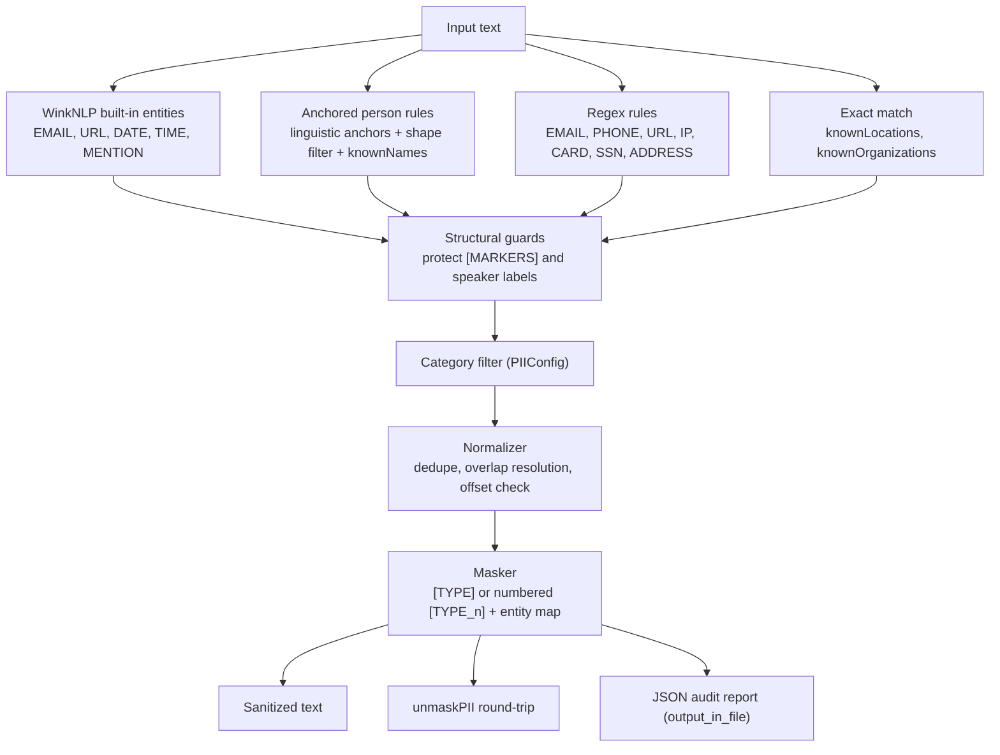

# WinkNLP + Regex Rules PII Detection (TypeScript POC)

A TypeScript proof of concept that tests whether **WinkNLP** can serve as the PII (personally identifiable information) detection engine for privacy middleware. WinkNLP's built-in entities are combined with deterministic regex rules and anchored person-name rules. A span normalizer merges the results, and a masking layer replaces them with generic (`[EMAIL]`) or numbered, reversible (`[EMAIL_1]`) placeholders. Everything runs locally in Node.js with a ~4.6 MB runtime footprint. This is an evaluation POC, not a production service.

Part of the [PII de-identification implementations](https://github.com/Ahmed-Maher77/LLM-Privacy-Gateway___PII-De-identification-and-Re-identification#readme) collection.

## At a glance

| | |
| --- | --- |
| **Language / runtime** | TypeScript (ESM) on Node.js 22.12+ |
| **Approach** | WinkNLP built-in entities, deterministic regex, anchored person rules and caller-supplied exact matches, merged by a span normalizer |
| **Entities** | Default: PERSON, EMAIL, PHONE, URL, IP_ADDRESS, CREDIT_CARD, SSN, ADDRESS. Opt-in: LOCATION, ORGANIZATION (caller lists), DATE, TIME, MENTION |
| **Reversible** | Yes, with numbered masking (`maskPIIWithMapping` + `unmaskPII`) |
| **Network at runtime** | None. The model ships inside the npm package |
| **Models** | `wink-eng-lite-web-model` 1.8.1 (3.8 MB on disk, ~1 MB gzipped). No statistical PERSON/LOCATION/ORGANIZATION NER |
| **Best for** | Transcripts, chat and logs where structured identifiers dominate and names appear with conversational cues or are known in advance. Also useful as a lightweight baseline |
| **Status** | Proof of concept. 60 tests passing |

## Contents

- [Quick start](#quick-start)
- [Usage](#usage)
- [How it works](#how-it-works)
- [Supported PII categories](#supported-pii-categories)
- [WinkNLP vs. regex detection](#winknlp-vs-regex-detection)
- [Evaluation results](#evaluation-results)
- [Performance](#performance)
- [Research findings (Q1-Q12)](#research-findings-q1-q12)
- [Recommendations](#recommendations)
- [Testing](#testing)
- [Limitations](#limitations)
- [Documentation](#documentation)
- [License](#license)

## Quick start

### Prerequisites

- Node.js **22.12 or later** (required by Vitest 5; Node 24 also supported)
- npm (the project ships a `package-lock.json`)

### Installation

This project is a submodule of the umbrella repository. Clone it with its submodules (see the [umbrella README](https://github.com/Ahmed-Maher77/LLM-Privacy-Gateway___PII-De-identification-and-Re-identification#readme)), then install:

```bash
git clone --recurse-submodules https://github.com/Ahmed-Maher77/LLM-Privacy-Gateway___PII-De-identification-and-Re-identification.git
cd LLM-Privacy-Gateway___PII-De-identification-and-Re-identification/03-ts-winknlp-regex-rules-poc
npm install
```

The install pulls in only two runtime dependencies (`wink-nlp`, `wink-eng-lite-web-model`). The full `node_modules`, with the TypeScript and Vitest toolchain, is about 89 MB.

### First run

```bash
npm test          # 60 tests across 9 files
npm run demo      # detect, mask and round-trip samples/large_sample.txt
```

The demo prints the detected entities, the numbered masked text, the entity map and a round-trip check (`Unmasked text matches original input verbatim: true`). It writes `sanitized_output/sanitized_output.txt` and `sanitized_output/sanitized_output_report.json`.

## Usage

### Scripts

| Command | What it does |
| --- | --- |
| `npm test` | Runs the Vitest suite once (60 tests, 9 files). |
| `npm run test:watch` | Runs Vitest in watch mode. |
| `npm run demo` | Runs `samples/large_sample.txt` through `detectPII` (defaults plus `date: true`), numbered masking and an unmask round-trip, then writes `sanitized_output/`. |
| `npm run demo -- "<text>"` | Same as above on inline text, for example `npm run demo -- "Contact Ahmed at ahmed@example.com or call +20 100 123 4567."`. Arguments that start with `-` are ignored. This also overwrites `sanitized_output/`. |
| `npm run evaluate` | Runs the labelled synthetic dataset (20 cases, 29 entities) across five engine configurations. Prints precision, recall and F1 tables. |
| `npm run benchmark` | Measures latency (avg, min, max, p95) and throughput over 100, 1,000 and 10,000 synthetic documents. |
| `npm run build` | Compiles `src/` to `dist/` (ES2022, NodeNext, with `.d.ts` and source maps). |

The files in `sanitized_output/` are committed as the reference output. Running the demo regenerates them, and the report's timestamp changes.

### Library API

`src/index.ts` re-exports the detectors, normalizer, masker, configuration helpers, types and the file writer. The main functions are:

| Function | Signature |
| --- | --- |
| `detectPII` | `(text: string, config?: Partial<PIIConfig>) => PIIMatch[]` |
| `maskPII` | `(text: string, matches: PIIMatch[], options?: MaskOptions) => string` |
| `maskPIIWithMapping` | `(text: string, matches: PIIMatch[], options?: MaskOptions) => { maskedText, entityMap, entities }` |
| `unmaskPII` | `(maskedText: string, entityMap: Record<string, string>) => string` |
| `output_in_file` / `outputInFile` | `(sanitizedText: string, options?: OutputInFileOptions) => { outputPath, reportPath }` |

Each `PIIMatch` is `{ type, value, start, end, method: 'winknlp' | 'regex' | 'rule', confidence? }`. For every match, `text.slice(start, end) === value`.

**Detection and generic masking:**

```ts
import { detectPII, maskPII } from './src/index.js';

const text =
  'My name is Ahmed Maher. My email is ahmed@example.com and my phone is +20 100 123 4567. Card on file: 4532-0150-0000-0007.';

const matches = detectPII(text);
// [
//   { type: 'PERSON',      value: 'Ahmed Maher',         start: 11,  end: 22,  method: 'rule',  confidence: 0.95 },
//   { type: 'EMAIL',       value: 'ahmed@example.com',   start: 36,  end: 53,  method: 'regex', confidence: 0.99 },
//   { type: 'PHONE',       value: '+20 100 123 4567',    start: 70,  end: 86,  method: 'regex', confidence: 0.95 },
//   { type: 'CREDIT_CARD', value: '4532-0150-0000-0007', start: 102, end: 121, method: 'regex', confidence: 0.98 }
// ]

maskPII(text, matches);
// 'My name is [PERSON]. My email is [EMAIL] and my phone is [PHONE]. Card on file: [CREDIT_CARD].'
```

**Reversible numbered masking:**

```ts
import { detectPII, maskPIIWithMapping, unmaskPII } from './src/index.js';

const text = 'Hi Sarah, this is John Smith. Email sarah@example.com or john@example.com.';

const { maskedText, entityMap, entities } = maskPIIWithMapping(text, detectPII(text), {
  numbered: true,             // [TYPE_n] instead of [TYPE]; required for reversibility
  numberingStrategy: 'entity', // identical values share a placeholder ('occurrence' numbers every hit)
  indexBase: 1,
});
// maskedText: 'Hi [PERSON_1], this is [PERSON_2]. Email [EMAIL_1] or [EMAIL_2].'
// entityMap:  { '[PERSON_1]': 'Sarah', '[PERSON_2]': 'John Smith',
//               '[EMAIL_1]': 'sarah@example.com', '[EMAIL_2]': 'john@example.com' }

unmaskPII(maskedText, entityMap) === text; // true
```

`entities` lists each placeholder with its type, index, value and occurrence count. Constraints on reversibility:

- Only numbered mode is reversible. In generic mode every value of a type maps to the same `[TYPE]` key, so the entity map keeps only the last one.
- `unmaskPII` replaces every placeholder-shaped string it finds. If the original text already contains a literal such as `[EMAIL_1]`, the round-trip will not be exact.
- The entity map holds the original plaintext. Store it as sensitive data.

The package is not published to npm. Import from `src/` with `tsx`, or run `npm run build` and import `dist/index.js`. `src/index.ts` also re-exports the file writer, which uses `node:fs`, so the entry point runs on Node only as written.

### Configuration

Pass a partial `PIIConfig` to `detectPII`. Omitted fields fall back to `DEFAULT_PII_CONFIG` (`src/pii/config.ts`).

| Option | Default | Description |
| --- | --- | --- |
| `person` | `true` | Detect PERSON. |
| `personStrategy` | `'anchored'` | `'anchored'` uses conversational anchors and a shape filter. `'propn'` uses the legacy WinkNLP proper-noun heuristic, kept for comparison. `'off'` disables person detection. |
| `knownNames` | `[]` | Names matched exactly as whole words (case-sensitive). Applies only with the `anchored` strategy. |
| `knownLocations` | `[]` | Locations matched exactly. Requires `location: true`. |
| `knownOrganizations` | `[]` | Organizations matched exactly. Requires `organization: true`. |
| `email`, `phone`, `url`, `ipAddress`, `creditCard`, `ssn`, `address` | `true` | Toggles for each category. |
| `strictLuhn` | `false` | Rejects card numbers that fail the Luhn check. By default, separator-grouped numbers with a known brand prefix are still masked. |
| `location`, `organization` | `false` | Enable caller-list matching for these types. |
| `date`, `time`, `mention` | `false` | WinkNLP DATE (only spans containing digits), TIME and `@mention` entities. |
| `misc` | `false` | Reserved. No detector emits `MISC` yet. |
| `enableWinkNLP` | `true` | Run the WinkNLP engine. |
| `enableRegex` | `true` | Run the regex engine. |

```ts
detectPII(text, {
  date: true,
  location: true,
  knownLocations: ['Cairo'],
  knownNames: ['Tim Cook'],
});
```

## How it works


```mermaid
flowchart TD
    A["Input text"] --> B1["WinkNLP built-in entities<br/>EMAIL, URL, DATE, TIME, MENTION"]
    A --> B2["Anchored person rules<br/>linguistic anchors + shape filter + knownNames"]
    A --> B3["Regex rules<br/>EMAIL, PHONE, URL, IP, CARD, SSN, ADDRESS"]
    A --> B4["Exact match<br/>knownLocations, knownOrganizations"]
    B1 & B2 & B3 & B4 --> C["Structural guards<br/>protect [MARKERS] and speaker labels"]
    C --> D["Category filter (PIIConfig)"]
    D --> E["Normalizer<br/>dedupe, overlap resolution, offset check"]
    E --> F["Masker<br/>[TYPE] or numbered [TYPE_n] + entity map"]
    F --> G1["Sanitized text"]
    F --> G2["unmaskPII round-trip"]
    F --> G3["JSON audit report (output_in_file)"]
```

1. **Detection.** `detectPII` runs each engine in turn, synchronously:
   - WinkNLP built-in entities. Token spans are converted to character offsets using token lengths and `precedingSpaces`.
   - Anchored person rules: "my name is X", "I am / this is X", titles such as "Mr. X", greetings and sign-offs such as "Hi X", account phrases such as "on behalf of X Y", and "X Y speaking". Candidates then pass a shape filter that rejects digits, all-caps tokens and role words such as `Agent` or `System`.
   - Deterministic regex rules.
   - Caller-supplied exact matches.
2. **Structural guards.** Heuristic PERSON, LOCATION and ORGANIZATION matches that overlap bracketed markers (`[START OF TRANSCRIPT]`) or line-leading labels (`Agent:`) are dropped. Deterministic types and caller-supplied known values are never suppressed.
3. **Normalization.** Spans are deduplicated and overlaps resolved: the enclosing or longer span wins, and regex gets a small confidence tiebreak. The step also enforces `text.slice(start, end) === value`.
4. **Masking.** Placeholders are numbered in reading order and substituted right to left, so earlier offsets stay valid. Detection never mutates text, and masking never classifies.

Shape takes precedence over validity. Luhn checksums and SSA issuance rules only change the confidence score, so a mistyped or fake card number or SSN is still masked.

The pipeline, module map, invariants and "which file do I change" guide are in [docs/ARCHITECTURE.md](docs/ARCHITECTURE.md).

## Supported PII categories

| Category | Default | Method | Coverage |
| :--- | :--- | :--- | :--- |
| `EMAIL` | On | WinkNLP + regex | Pragmatic ASCII pattern (`local@domain.tld`), including sub-domains such as `.co.uk` |
| `PHONE` | On | Regex | International (`+20`, `+1`, `(+20)`), US `(555) 123-4567` / `555-123-4567`, Egyptian local mobile `01xxxxxxxxx`. 7-15 digits; ISO dates rejected |
| `URL` | On | WinkNLP + regex | `http://`, `https://` and `www.` URLs, with trailing punctuation trimmed |
| `IP_ADDRESS` | On | Regex | IPv4 with 0-255 octet validation (no IPv6) |
| `CREDIT_CARD` | On | Regex + Luhn | 13-19 digits (4-4-4-4 or Amex 4-6-5). Luhn-valid, or brand prefix with separators (scored) |
| `SSN` | On | Regex | US `ddd-dd-dddd`. SSA issuability affects only the score |
| `ADDRESS` | On | Regex | US street number + street suffix, optional city, state and ZIP |
| `PERSON` | On | Anchored rules | Conversational anchors + shape validation, plus optional `knownNames` |
| `LOCATION` | Off | Caller list | Exact match on `knownLocations` (WinkNLP has no location NER) |
| `ORGANIZATION` | Off | Caller list | Exact match on `knownOrganizations` (WinkNLP has no organization NER) |
| `DATE` | Off | WinkNLP | Absolute dates such as `April 1, 1976` and `2023-10-27`. Spans without digits (`today`) are dropped |
| `TIME` | Off | WinkNLP | Time references |
| `MENTION` | Off | WinkNLP | Social handles (`@username`) |

## WinkNLP vs. regex detection

| PII type | WinkNLP native | Regex / rules | Finding |
| :--- | :--- | :--- | :--- |
| Person | No (no NER) | Anchored rules | The lite model has no PERSON NER. Anchored rules give 0 false positives on the evaluation set. Adding `knownNames` raises PERSON recall to 85.7% with 1 false positive. |
| Email | Yes | Yes | Both detect emails reliably. Regex adds boundary safety. |
| Phone | No | Yes | WinkNLP tokenizes phone numbers into digits and punctuation. Regex is required. |
| URL | Yes | Yes | WinkNLP found 2 of 3 evaluation URLs and sometimes captures trailing punctuation. Regex trims it. |
| IP address | No | Yes | WinkNLP splits IPs into several CARDINAL tokens. Regex with 0-255 validation is deterministic. |
| Credit card | No | Yes | WinkNLP treats cards as cardinals or hyphenated tokens. Regex with brand prefix + Luhn masks by shape. |
| SSN | No | Yes | WinkNLP splits it into numbers and hyphens. Regex masks by shape and scores SSA validity. |
| Address | No | Yes | `ADDRESS_PATTERN` captures street suffixes, city, state and ZIP. |
| Date | Yes | — | Built-in DATE. Filtered to require digits so that relative terms are excluded. |
| Location | No (no NER) | Caller list | Supported through `knownLocations`. |
| Organization | No (no NER) | Caller list | Supported through `knownOrganizations`. |

See [docs/WINKNLP-CAPABILITIES.md](docs/WINKNLP-CAPABILITIES.md) for the full capability matrix.

## Evaluation results

`npm run evaluate` runs 20 synthetic labelled cases (16 anchored, 4 unanchored) containing 29 ground-truth entities: PERSON 7, EMAIL 7, PHONE 5, URL 3, IP 2, LOCATION 2, card 1, SSN 1, organization 1. The dataset has no ADDRESS or DATE labels, and the set is small, so treat the figures as indicative.

### Engine comparison

| Configuration | Precision | Recall | F1 | TP | FP | FN | Notes |
| :--- | :--- | :--- | :--- | :--- | :--- | :--- | :--- |
| 1. WinkNLP built-in only | 90.0% | 31.0% | 46.2% | 9 | 1 | 20 | Emails and URLs only; 1 false-positive DATE |
| 2. Regex alone | 100.0% | 65.5% | 79.2% | 19 | 0 | 10 | Structured PII (email, phone, URL, IP, card, SSN) |
| 3. Hybrid, anchored (default) | 100.0% | 75.9% | 86.3% | 22 | 0 | 7 | No false positives |
| 4. Hybrid, PROPN heuristic | 67.6% | 86.2% | 75.8% | 25 | 12 | 4 | Higher recall, 12 false positives |
| 5. Hybrid, anchored + `knownNames` | 96.2% | 86.2% | 90.9% | 25 | 1 | 4 | Recovers unanchored names |

### Category breakdown (default anchored hybrid)

| Category | TP | FP | FN | Precision | Recall | F1 | Notes |
| :--- | :--- | :--- | :--- | :--- | :--- | :--- | :--- |
| `EMAIL` | 7 | 0 | 0 | 100.0% | 100.0% | 100.0% | Standard and sub-domain addresses |
| `PHONE` | 5 | 0 | 0 | 100.0% | 100.0% | 100.0% | International (+20, +1) and local mobile |
| `URL` | 3 | 0 | 0 | 100.0% | 100.0% | 100.0% | Protocol and `www` prefixes |
| `IP_ADDRESS` | 2 | 0 | 0 | 100.0% | 100.0% | 100.0% | 0-255 octet validation |
| `CREDIT_CARD` | 1 | 0 | 0 | 100.0% | 100.0% | 100.0% | Format and checksum |
| `SSN` | 1 | 0 | 0 | 100.0% | 100.0% | 100.0% | 9-digit format |
| `PERSON` | 3 | 0 | 4 | 100.0% | 42.9% | 60.0% | Anchored mentions only |
| `LOCATION` | 0 | 0 | 2 | 0.0% | 0.0% | 0.0% | No NER (not enabled in this run; `knownLocations` is available) |
| `ORGANIZATION` | 0 | 0 | 1 | 0.0% | 0.0% | 0.0% | No NER (not enabled in this run; `knownOrganizations` is available) |

### PERSON strategy by cohort

| Strategy | Cohort | Overall P | Overall R | PERSON TP | PERSON FP | PERSON P | PERSON R |
| :--- | :--- | :--- | :--- | :--- | :--- | :--- | :--- |
| `off` | All | 100.0% | 65.5% | 0 | 0 | — | 0.0% |
| `anchored` (default) | Anchored | 100.0% | 100.0% | 3 | 0 | 100.0% | 100.0% |
| `anchored` (default) | Unanchored | 100.0% | 22.2% | 0 | 0 | — | 0.0% |
| `anchored` (default) | All | 100.0% | 75.9% | 3 | 0 | 100.0% | 42.9% |
| `propn` | All | 67.6% | 86.2% | 6 | 12 | 33.3% | 85.7% |
| `anchored` + `knownNames` | All | 96.2% | 86.2% | 6 | 1 | 85.7% | 85.7% |

The remaining PERSON miss with `knownNames` is the Arabic-script name `أحمد`, because the name patterns are ASCII-only.

## Performance

`npm run benchmark` times the regex engine alone, WinkNLP alone and the combined `detectPII`. The workload is synthetic: 8 templates of 82-109 characters, each prefixed with `[Req-n]`, run after 10 warm-up iterations. Average latency is total time divided by document count.

Published run, Node.js v24 (hardware not recorded):

| Scale | Engine | Total | Avg | Min | Max | p95 | Throughput |
| :--- | :--- | :--- | :--- | :--- | :--- | :--- | :--- |
| 100 docs | Regex rules | 0.6 ms | 0.006 ms | 0.002 ms | 0.033 ms | 0.015 ms | 165,098 doc/s |
| | WinkNLP built-in | 17.9 ms | 0.179 ms | 0.088 ms | 0.424 ms | 0.302 ms | 5,584 doc/s |
| | Combined hybrid | 27.3 ms | 0.273 ms | 0.116 ms | 6.084 ms | 0.508 ms | 3,659 doc/s |
| 1,000 docs | Regex rules | 3.5 ms | 0.003 ms | 0.001 ms | 0.125 ms | 0.006 ms | 287,670 doc/s |
| | WinkNLP built-in | 133.7 ms | 0.134 ms | 0.061 ms | 3.837 ms | 0.231 ms | 7,480 doc/s |
| | Combined hybrid | 124.4 ms | 0.124 ms | 0.062 ms | 3.117 ms | 0.201 ms | 8,041 doc/s |
| 10,000 docs | Regex rules | 30.7 ms | 0.003 ms | 0.001 ms | 1.251 ms | 0.005 ms | 325,419 doc/s |
| | WinkNLP built-in | 949.2 ms | 0.095 ms | 0.039 ms | 5.749 ms | 0.173 ms | 10,535 doc/s |
| | Combined hybrid | 1,057.0 ms | 0.106 ms | 0.055 ms | 2.095 ms | 0.196 ms | 9,461 doc/s |

In that run, the combined engine processed 10,000 short documents in about 1.06 s (0.106 ms average, 0.196 ms p95).

Results depend on the machine. A single re-run on Node.js 22.19 (Intel i7-11850H, Windows 11) measured 2,787 ms for the same 10,000 documents: 0.279 ms average, 0.505 ms p95, 3,588 doc/s. That is the same order of magnitude and still well under 1 ms per short document. WinkNLP tokenization dominates the cost, and the regex engine adds little.

## Research findings (Q1-Q12)

**Q1. Can WinkNLP detect names reliably?**
No. `wink-eng-lite-web-model` has no PERSON entity. A POS heuristic (consecutive `PROPN` tokens) reaches 85.7% PERSON recall but only 33.3% precision. It misclassifies capitalized sentence starters, technical terms, days of the week, role labels such as `Agent` and `System`, and acronyms.

**Q2. Can WinkNLP detect locations and organizations?**
No. The lite model has no LOCATION or ORGANIZATION extractor.

**Q3. Can WinkNLP detect emails, URLs and phone numbers?**
- Email: yes. Its built-in entity found all 7 evaluation emails with no false positives.
- URL: partly. It found 2 of 3 evaluation URLs and sometimes includes trailing punctuation such as brackets or quotes.
- Phone: no. Numbers are split into separate `CARDINAL` tokens and punctuation (`+20`, `100`, `123`, `4567`), so regex is required.

**Q4. Does WinkNLP provide reliable character offsets?**
Yes. WinkNLP returns token-level spans. Exact character offsets are rebuilt from cumulative token lengths and `precedingSpaces`, and every tested match satisfies `text.slice(start, end) === value`.

**Q5. How does it handle Arabic or mixed-language text?**
Arabic words are tagged as foreign tokens (`X`), which does not break tokenization. Emails and URLs inside Arabic text (for example `اسمي أحمد والبريد الإلكتروني ahmed@example.com`) are extracted with correct offsets. Arabic names such as `أحمد` cannot be found by either POS heuristics or the ASCII name patterns.

**Q6. How does it handle multiple entities in one sentence?**
Cleanly. The document is tokenized in one pass, and WinkNLP returns separate, non-overlapping entity spans.

**Q7. How does it handle entities surrounded by punctuation?**
Emails in angle brackets (`<user@example.com>`) are extracted without the brackets. URLs in parentheses or square brackets sometimes keep the closing bracket in WinkNLP. The regex detector trims trailing punctuation, and the normalizer prefers the regex span.

**Q8. Which categories need deterministic rules?**
Phone numbers (absent from WinkNLP NER), IP addresses (split into numbers and periods), credit cards (Luhn and brand checks), SSNs and national IDs (fixed patterns), and URL boundary cleanup.

**Q9. What false positives does WinkNLP produce?**
With the `PROPN` person heuristic: sentence-initial capitalized words (`Contact`, `Please`), technology terms (`API`, `Host`), days of the week (`Monday`), role labels and acronyms. Its built-in entities produced 1 false-positive DATE on the evaluation set.

**Q10. What false negatives does it produce?**
WinkNLP's native NER misses all phone numbers, IP addresses, credit cards, SSNs, locations and organizations. It also misses non-English names, which it tags as foreign words (`X`).

**Q11. What is the performance for typical request sizes?**
For documents of about 100 characters, the combined engine averaged 0.1-0.3 ms per document on a single Node.js thread. That is roughly 3,600-9,500 documents per second, depending on machine and run. See [Performance](#performance).

**Q12. Can it run entirely locally?**
Yes. Detection and masking run in memory with no network calls and no file I/O. The model is bundled in the npm package. Only the demo and `output_in_file` write files, and only to the local `sanitized_output/` folder.

## Recommendations

1. **Use a hybrid architecture.**
   - Use deterministic regex for structured identifiers: `EMAIL`, `PHONE`, `URL`, `IP_ADDRESS`, `CREDIT_CARD`, `SSN`.
   - Use WinkNLP for fast tokenization, sentence boundaries and temporal entities (`DATE`, `TIME`).
2. **Handle person, location and organization detection separately.**
   - If execution must stay local, evaluate a lightweight quantized ONNX transformer, for example `bert-base-NER` or GLiNER through transformers.js. These detect `PERSON`, `LOC` and `ORG` natively.
   - For narrow, known domains, use caller-supplied dictionaries (`knownNames`, `knownLocations`, `knownOrganizations`) or WinkNLP custom entities (`learnCustomEntities`).
3. **Keep masking decoupled.** Keep detection results as structured spans, separate from policy-driven text transformation.

## Testing

```bash
npm test
```

Vitest runs 60 tests in 9 files, in about 2 seconds:

| File | Tests | Covers |
| --- | --- | --- |
| `tests/pii-detector.test.ts` | 13 | End-to-end `detectPII`, including leak-regression cases |
| `tests/regex-detector.test.ts` | 10 | Deterministic rules, scored SSN and card, address regex |
| `tests/masker.test.ts` | 9 | Span replacement, numbered masking, round-trip unmasking, custom formatters |
| `tests/wink-detector.test.ts` | 9 | WinkNLP entities, absolute DATE filtering |
| `tests/person-detector.test.ts` | 6 | Anchored person detection, name filters, `knownNames` |
| `tests/normalizer.test.ts` | 4 | Deduplication, overlap absorption, offset check |
| `tests/sample-regression.test.ts` | 4 | Exact expected masked output for `samples/large_sample.txt` |
| `tests/structure.test.ts` | 3 | Structural guards for markers and labels |
| `tests/output-in-file.test.ts` | 2 | File and report writing (uses a temporary `sanitized_output_test/` folder that is cleaned up) |

`npx tsc --noEmit` type-checks the sources.

## Limitations

- **No statistical NER for people, places or organizations.** The lite model covers only web-centric entities (`CARDINAL`, `DATE`, `DURATION`, `EMAIL`, `EMOJI`, `EMOTICON`, `HASHTAG`, `MENTION`, `MONEY`, `ORDINAL`, `PERCENT`, `TIME`, `URL`). Names without a conversational anchor are missed (default PERSON recall is 42.9%) unless they are passed in `knownNames`. The same applies to later mentions of an anchored name: in `Hi Sarah, ... Sarah, email ...`, only the first `Sarah` is masked.
- **English and ASCII only.** POS tagging is trained on English, and the name patterns accept only ASCII capitalized tokens. Arabic and other non-Latin names are not detected.
- **Regional rules.** SSN and address rules are US-specific, the local phone format is Egyptian, and IP detection covers IPv4 only.
- **No contextual disambiguation.** WinkNLP cannot tell whether a number is an SSN, a phone number or a tracking ID. Only the regex shapes decide.
- **Reversibility requires numbered mode,** and input that already contains placeholder-shaped text such as `[EMAIL_1]` breaks the round-trip.
- **Small, synthetic evaluation set** (29 entities). The figures above are indicative only.

Every known defect, with evidence, root cause and status (KI-001 to KI-009), is recorded in [docs/KNOWN-ISSUES.md](docs/KNOWN-ISSUES.md).

## Documentation

| Document | Contents |
| --- | --- |
| [docs/README.md](docs/README.md) | Documentation index and current-state summary |
| [docs/ARCHITECTURE.md](docs/ARCHITECTURE.md) | Pipeline, module map, masking design, invariants |
| [docs/WINKNLP-CAPABILITIES.md](docs/WINKNLP-CAPABILITIES.md) | What WinkNLP can and cannot detect |
| [docs/KNOWN-ISSUES.md](docs/KNOWN-ISSUES.md) | Defect register |

## License

MIT. See [LICENSE](LICENSE).
